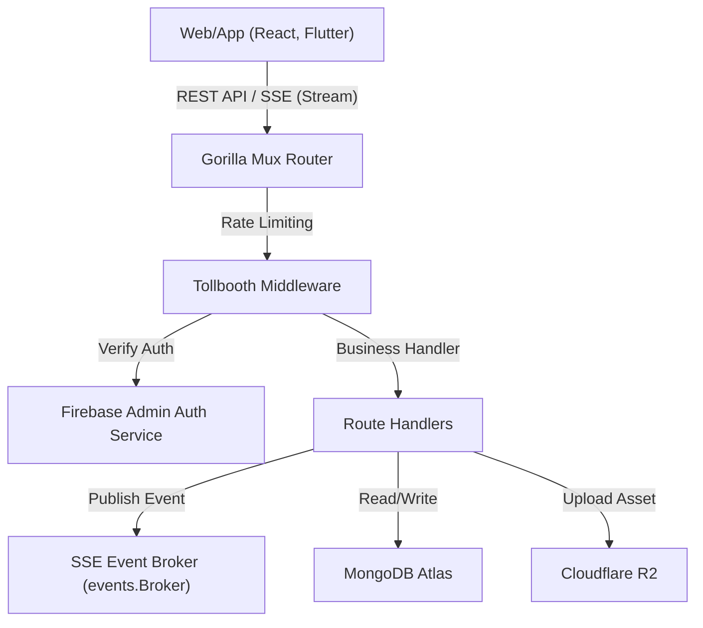

# Rusui - 백엔드 API 서버 (Go)

실시간 대기열 관리, 통계 대시보드, 그리고 AI 매장 안내 챗봇의 코어 인프라를 제공하는 **Rusui** 비즈니스 백엔드 API 서버

## Problem
* **실시간 데이터 동기화의 지연:** 수백 명의 대기 고객 및 매장 관리 스태프가 대기열 상태 변화(접수, 호출, 완료, 취소)를 지연 시간 없이 동시에 동기화받아야 하나, 기존의 폴링(Polling) 방식은 서버 리소스를 과도하게 소모하고 실시간성이 떨어집니다.
* **비정상적 과도 요청 및 보안 위협:** 대기열 접수 시 매크로 공격이나 과도한 무단 API 호출로 인해 서버 부하가 가중될 수 있으며, 비인가된 사용자가 데이터베이스를 직접 변조할 수 있는 보안 취약점이 존재합니다.
* **비정형 대용량 데이터 관리:** 매장 상세 설정, 수시로 변경되는 메뉴 구조, 일별 대기 데이터 통계화 및 대량의 사업자 등록증/메뉴판 이미지 업로드 등을 고속으로 처리하면서도 데이터 정합성을 잃지 않아야 합니다.

## Solution
* **Go Routine 기반 SSE(Server-Sent Events) 브로커 구축:** 무거운 웹소켓 연결 대신 가벼운 SSE 스트리밍 엔드포인트(`events/broker.go`)를 Go 채널과 고루틴 기반으로 구현하여, 대기열 상태 변경이 감지되는 즉시 연결된 클라이언트들로 변경 사항을 1초 이내에 단방향 푸시 스트리밍합니다.
* **미들웨어 기반 보안 레이어 확보:** `didip/tollbooth` 미들웨어를 도입하여 IP당 초당 요청 횟수를 제한(Rate Limiting)함으로써 비정상적인 디도스(DDoS) 형태의 과도한 API 공격을 차단하고, Firebase Admin SDK를 결합하여 모든 핵심 백오피스 API의 JWT 토큰 유효성을 백엔드 단에서 강력하게 검증합니다.
* **MongoDB Atlas 및 Cloudflare R2 결합:** 유연한 비정형 데이터 스키마 처리를 위해 MongoDB NoSQL을 채택하였고, 이미지 등 무거운 파일 에셋 업로드는 S3 API 호환 고성능 스토리지인 Cloudflare R2로 대행하도록 설계하여 데이터베이스 및 백엔드 서버 본체의 저장 부하를 차단했습니다.

## Tech Stack
* **Language:** Go (Golang) 1.23
* **HTTP Router:** Gorilla Mux
* **Database:** MongoDB Atlas
* **Storage:** Cloudflare R2 (S3 API Client)
* **Security:** Firebase Admin SDK (JWT Validation), rs/cors, didip/tollbooth (Rate Limiter)
* **Deployment:** Fly.io, Docker (Multi-stage Build)

## Architecture
### 1. 디렉토리 구조
```bash
yoyaku_mate_server/
├── auth/           # Firebase Admin SDK 토큰 검증 및 인증 미들웨어
├── config/         # 환경 변수 로드 및 구성 설정 관리 로직
├── data/           # MongoDB 쿼리 실행 및 데이터 접근(DAO) 비즈니스 로직
├── db/             # MongoDB Atlas 연결 수립 및 드라이버 설정
├── events/         # 고루틴 기반 실시간 SSE 이벤트 발행/구독 브로커 (broker.go)
├── handlers/       # 라우터 엔드포인트별 비즈니스 핸들러 함수
├── models/         # MongoDB 스키마에 매핑되는 Go 구조체 정의
├── utils/          # HMAC 토큰 발급, 로거, 공통 유틸리티 함수
├── Dockerfile      # Fly.io 배포를 위한 도커 멀티스테이지 빌드 환경 구성
├── fly.toml        # Fly.io 애플리케이션 가상 서버 설정
├── main.go         # 서버 실행 진입점 및 미들웨어/라우팅 등록
└── go.mod          # 의존성 모듈 정의 파일
```

### 2. 데이터 흐름 아키텍처


## Lessons Learned
* **고루틴 누수(Goroutine Leak) 차단:** SSE 스트리밍 연결 시, 클라이언트의 예상치 못한 연결 종료(Context Done)를 즉각 감지하지 못하면 브로커 내부 고루틴이 소멸하지 않고 계속 누적되는 문제를 방지하기 위해, Context와 Select 채널을 활용한 생명주기 관리 기법을 철저히 설계했습니다.
* **Rate Limiter 미세 튜닝:** 병렬로 다수의 에셋이나 API 호출을 동시에 전송하는 모바일/웹 클라이언트 환경의 특성을 고려하여, 정상적인 사용자 경험을 해치지 않도록 속도 제한 임계치와 버스트(Burst 10) 한도를 튜닝해 보안성과 사용성을 동시 확보했습니다.
* **NoSQL 정합성 및 안전한 예외 처리:** MongoDB Atlas 드라이버 쿼리 작성 시 예외 처리를 누락하지 않고 try-catch 패턴과 유사하게 에러 변수를 명확히 캐치하여 반환하도록 구성했으며, 트랜잭션이 부재한 단일 도큐먼트 쓰기 작업에서의 무결성을 유효성 검증 함수를 도입해 확보했습니다.

## Getting Started (시작 가이드)

### 1. 환경 변수 설정
로컬 구동 및 배포 환경에서 작동시키기 위해 아래 환경 변수 바인딩이 필요합니다.

```env
PORT=:8080                               # 서버 포트
MONGODB_URI=YOUR_MONGODB_ATLAS_URI       # MongoDB Atlas 접속 경로
MONGODB_DATABASE=YOUR_DB_NAME            # 데이터베이스 이름
HMAC_SECRET=YOUR_SECURE_HMAC_KEY         # 토큰 암호화 보안 키
R2_ACCOUNT_ID=YOUR_R2_ACCOUNT_ID         # Cloudflare R2 계정 ID
R2_ACCESS_KEY=YOUR_R2_ACCESS_KEY         # R2 액세스 키
R2_SECRET_KEY=YOUR_R2_SECRET_KEY         # R2 시크릿 키
R2_ASSETS_BUCKET_NAME=assets-bucket      # 업로드용 R2 버킷 명칭
```

### 2. 로컬 실행
로컬 구동을 위해서는 `config/development.json` 및 `config/serviceAccountKey.json` 설정 파일이 사전에 등록되어야 합니다.

```bash
# 의존성 모듈 다운로드
go mod download

# 서버 구동
go run main.go
```
서버가 성공적으로 구동되면 `http://localhost:8080` 포트로 API 게이트웨이가 작동합니다.

## Deploy (배포)
본 백엔드 프로젝트는 **Fly.io**에 Docker 기반 멀티스테이지 빌드 방식으로 배포됩니다.
기본 구성된 GitHub Actions 워크플로우를 통하여 `main` 브랜치 푸시 시 자동 빌드 및 배포가 수행됩니다.

```bash
# 로컬 터미널에서 직접 Fly.io 배포를 트리거할 시
flyctl deploy
```
