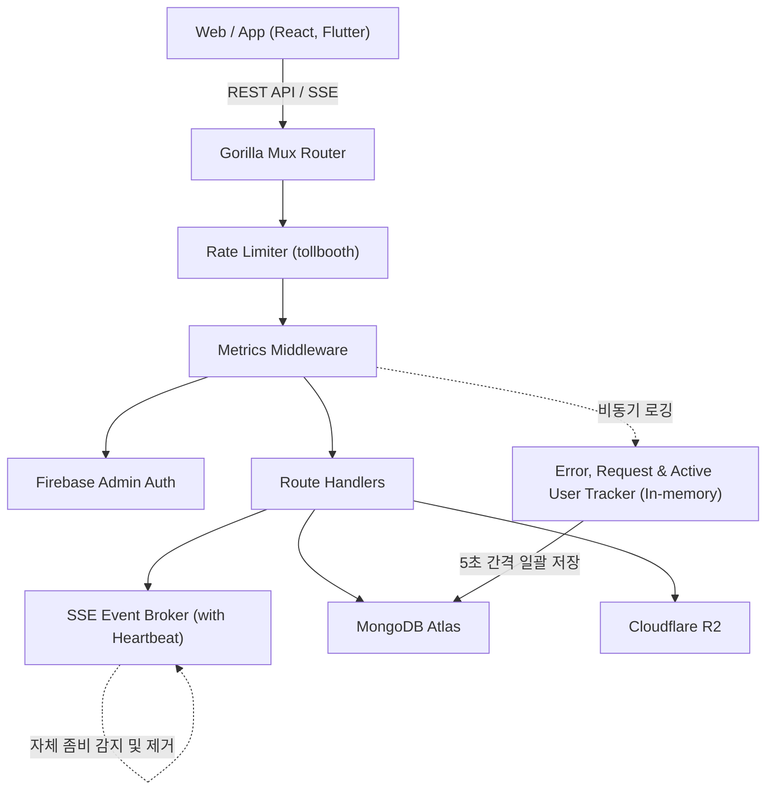

# Rusui — Backend API Server

실시간 대기열 관리, 통계 대시보드, AI 점포 안내 챗봇을 제공하는 Go 백엔드 API 서버입니다.

## Tech Stack

| 항목 | 기술 |
|------|------|
| Language | Go 1.23 |
| HTTP Router | Gorilla Mux |
| Database | MongoDB Atlas |
| Storage | Cloudflare R2 |
| Auth | Firebase Admin SDK |
| Rate Limiting | tollbooth |
| Deployment | fly.io + Docker |

## Getting Started

```bash
# 의존성 설치
go mod download

# 서버 실행
go run main.go
```

서버가 정상 시작되면 `http://localhost:8080` 에서 동작합니다.

### 환경 변수

```env
PORT=:8080
MONGODB_URI=your_mongodb_atlas_uri
HMAC_SECRET=your_hmac_secret_key
R2_ACCOUNT_ID=your_r2_account_id
R2_ACCESS_KEY=your_r2_access_key
R2_SECRET_KEY=your_r2_secret_key
R2_ASSETS_BUCKET_NAME=your_assets_bucket
```

로컬 실행 시 `config/development.json` 및 `config/serviceAccountKey.json` 파일이 필요합니다.

## Deploy

fly.io에 Docker 멀티스테이지 빌드 방식으로 배포됩니다.  
`main` 브랜치 푸시 시 GitHub Actions를 통해 자동 배포됩니다.

```bash
# 로컬에서 직접 배포
flyctl deploy
```

## Architecture

```
handlers/   → HTTP 파싱, 인증, 비즈니스 룰 검증
data/       → MongoDB 쿼리 (데이터 접근 계층)
events/     → SSE Broker (in-memory pub/sub) 및 Heartbeat 좀비 연결 제거
metrics/    → 에러, API 리퀘스트, 응답시간(Response Time), 활성 사용자(Concurrent/DAU/MAU), 감사 로그(Audit Log) 수집, 인메모리 버퍼링, 비동기 배치 저장
auth/       → Firebase 토큰 / 세션 검증
models/     → Go 구조체 ↔ BSON/JSON
utils/      → 공통 유틸 (HMAC, JSON 응답 등)
```



→ 상세 구조: [`docs/implementation/architecture.md`](./docs/implementation/architecture.md)

## Documentation

구현 상세, 설계 결정, 트러블슈팅 기록은 [`docs/`](./docs/README.md)를 참조하세요.
