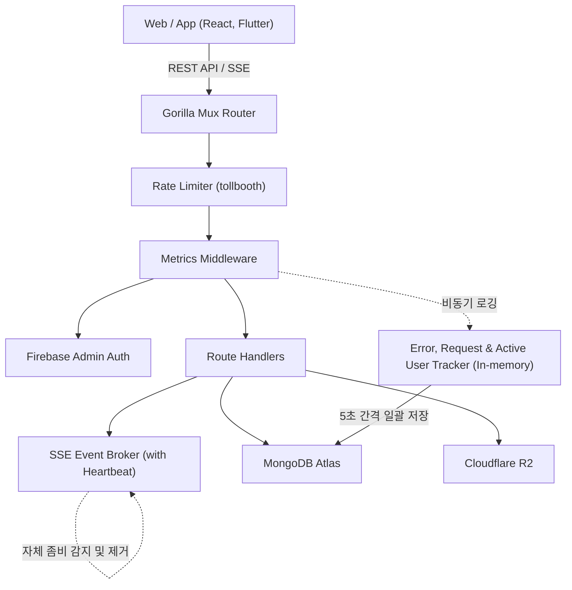

# Rusui — Backend API Server

실시간 대기열 관리, 통계 대시보드, AI 점포 안내 챗봇을 제공하는 Go 백엔드 API 서버입니다.

## Tech Stack

| 항목 | 기술 |
|------|------|
| Language | Go 1.23 |
| HTTP Router | Gorilla Mux |
| Database | MongoDB Atlas |
| Storage | Cloudflare R2 |
| Auth | Firebase Admin SDK |
| Rate Limiting | tollbooth |
| Deployment | fly.io + Docker |

## Getting Started

```bash
# 의존성 설치
go mod download

# 서버 실행
go run main.go
```

서버가 정상 시작되면 `http://localhost:8080` 에서 동작합니다.

### 환경 변수

```env
PORT=:8080
MONGODB_URI=your_mongodb_atlas_uri
HMAC_SECRET=your_hmac_secret_key
R2_ACCOUNT_ID=your_r2_account_id
R2_ACCESS_KEY=your_r2_access_key
R2_SECRET_KEY=your_r2_secret_key
R2_ASSETS_BUCKET_NAME=your_assets_bucket
```

로컬 실행 시 `config/development.json` 및 `config/serviceAccountKey.json` 파일이 필요합니다.

## Deploy

fly.io에 Docker 멀티스테이지 빌드 방식으로 배포됩니다.

| 환경 | 앱 | 설정 | 배포 방법 |
|---|---|---|---|
| 개발 | `rusui-dev` | `fly.toml` | `develop` push 시 자동 (테스트 통과 후) |
| 프로덕션 | `rusui-prod` | `fly.prod.toml` | `main` push(PR 머지) 시 자동 (테스트 통과 후, blue-green). 재배포는 Actions → **Fly Deploy (Prod)** → Run workflow |

- `main` 머지 = prod 배포. 매장 영업시간 중 머지는 피할 것 (모든 매장의 SSE가 잠깐 끊겼다가 재연결됨)
- prod는 로컬에서 `flyctl deploy`하지 말 것. flyctl은 git과 무관하게 로컬 폴더를 그대로 빌드하므로,
  다른 브랜치나 커밋 안 된 변경이 그대로 prod에 나간다
- 인자 없는 `flyctl deploy`는 어느 브랜치에서 실행하든 `rusui-dev`로 배포된다

## Architecture

```
handlers/   → HTTP 파싱, 인증, 비즈니스 룰 검증 (Repository Pattern & DI 적용)
data/       → MongoDB 쿼리 (데이터 접근 계층 - Repository 구현체)
events/     → SSE Broker (in-memory pub/sub) 및 Heartbeat 좀비 연결 제거
metrics/    → 에러, API 리퀘스트, 응답시간, 활성 사용자, 감사 로그, 시스템 리소스(CPU/Mem/Disk), DB 메트릭스 수집
auth/       → Firebase 토큰 / 세션 검증
models/     → Go 구조체 ↔ BSON/JSON
utils/      → 공통 유틸 (HMAC, JSON 응답 등)
```


```mermaid
graph TD
    Client["Web / App (React, Flutter)"] -->|"REST API / SSE"| Router["Gorilla Mux Router"]
    Router --> Middleware["Rate Limiter (tollbooth)"]
    Middleware --> Metrics["Metrics Middleware"]
    Metrics --> Auth["Firebase Admin Auth"]
    Metrics --> Handlers["Route Handlers"]
    Handlers --> Broker["SSE Event Broker (with Heartbeat)"]
    Handlers --> DB["MongoDB Atlas"]
    Handlers --> Storage["Cloudflare R2"]
    
    Metrics -.->|비동기 로깅| Tracker["Error, Request & Active User Tracker (In-memory)"]
    Tracker -->|5초 간격 일괄 저장| DB
    Broker -.->|자체 좀비 감지 및 제거| Broker
```

→ 상세 구조: [`docs/implementation/architecture.md`](./docs/implementation/architecture.md)

## Documentation

구현 상세, 설계 결정, 트러블슈팅 기록은 [`docs/`](./docs/README.md)를 참조하세요.
