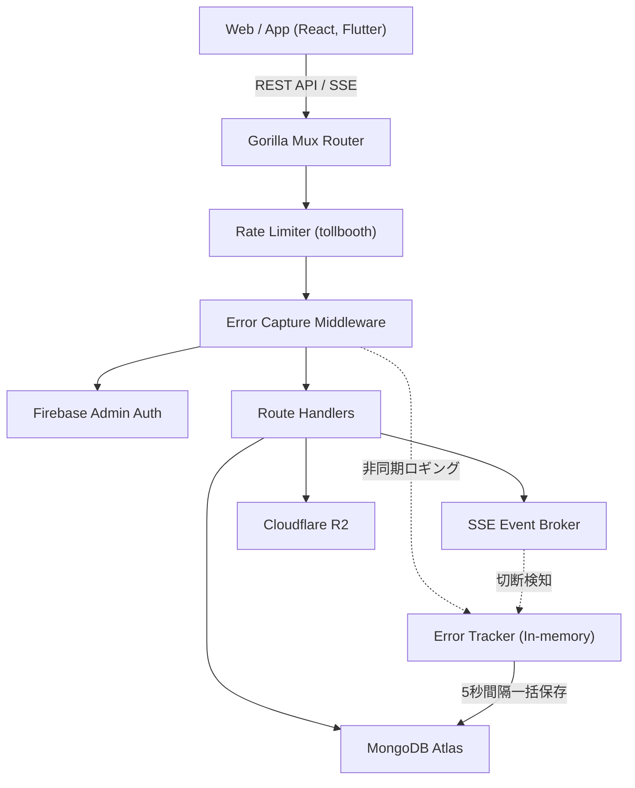

# Rusui — Backend API Server

リアルタイム待機列管理、統計ダッシュボード、AI店舗案内チャットボットを提供するGoバックエンドAPIサーバーです。

## Tech Stack

| 項目 | 技術 |
|------|------|
| Language | Go 1.23 |
| HTTP Router | Gorilla Mux |
| Database | MongoDB Atlas |
| Storage | Cloudflare R2 |
| Auth | Firebase Admin SDK |
| Rate Limiting | tollbooth |
| Deployment | fly.io + Docker |

## Getting Started

```bash
# 依存関係のインストール
go mod download

# サーバーの起動
go run main.go
```

サーバーが正常に起動すると、 `http://localhost:8080` で動作します。

### 環境変数

```env
PORT=:8080
MONGODB_URI=your_mongodb_atlas_uri
HMAC_SECRET=your_hmac_secret_key
R2_ACCOUNT_ID=your_r2_account_id
R2_ACCESS_KEY=your_r2_access_key
R2_SECRET_KEY=your_r2_secret_key
R2_ASSETS_BUCKET_NAME=your_assets_bucket
```

ローカルでの実行には、 `config/development.json` および `config/serviceAccountKey.json` ファイルが必要です。

## Deploy

fly.ioにDockerマルチステージビルド方式でデプロイされます。  
`main` ブランチにプッシュすると、GitHub Actionsを通じて自動的にデプロイされます。

```bash
# ローカルからの直接デプロイ
flyctl deploy
```

## Architecture

```
handlers/   → HTTPパース、認証、ビジネスルールの検証
data/       → MongoDBクエリ (データアクセス層)
events/     → SSE Broker (インメモリpub/sub)
metrics/    → エラーメトリクスの収集、インメモリバッファリング、非同期バッチ保存
auth/       → Firebaseトークン/セッション検証
models/     → Go構造体 ↔ BSON/JSON
utils/      → 共通ユーティリティ (HMAC、JSONレスポンスなど)
```



→ 詳細構造: [`docs/implementation/architecture.md`](./docs/implementation/architecture.md)

## Documentation

実装の詳細、設計決定、トラブルシューティングの記録は、 [`docs/`](./docs/README.md) を参照してください。
