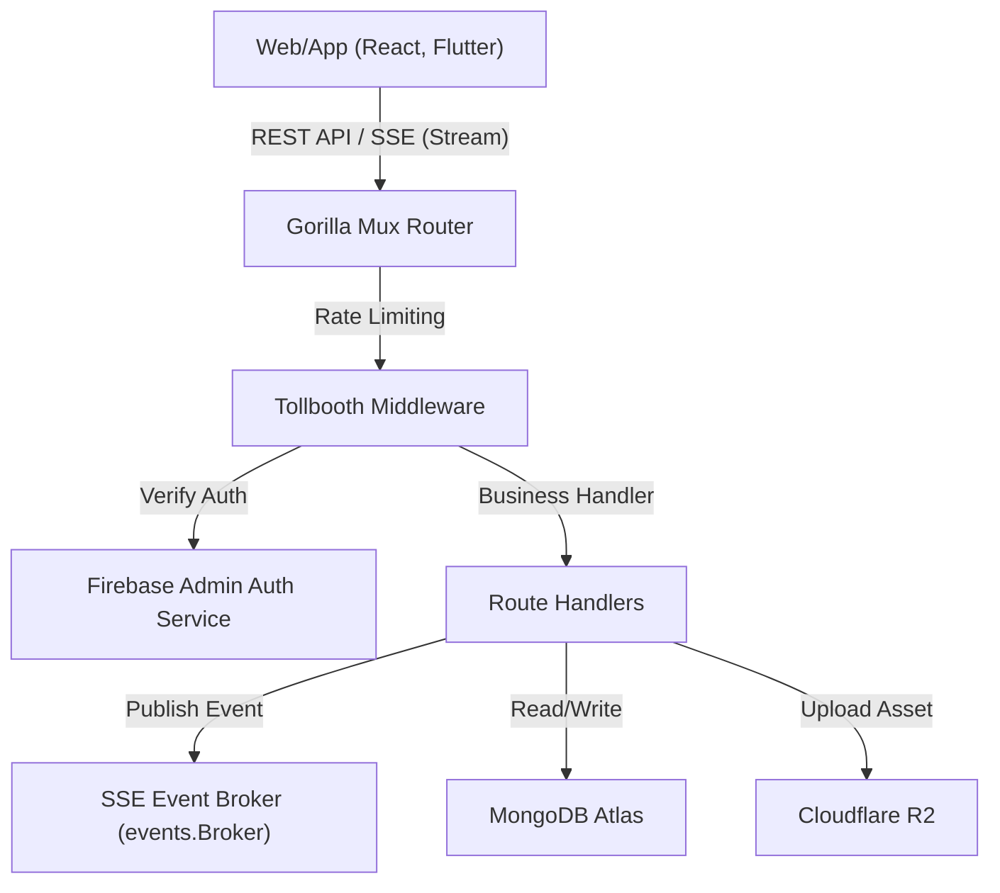

# Rusui - バックエンドAPIサーバー（Go）

リアルタイム待機列管理、統計ダッシュボード、およびAI店舗案内チャットボットのコアインフラを提供する**Rusui**ビジネスバックエンドAPIサーバー

## Problem
* **リアルタイムデータ同期の遅延:** 数百人規模の待機顧客および店舗管理スタッフが、待機列のステータス変化（登録、呼び出し、完了、キャンセル）を遅延なく同時に同期する必要がありますが、従来のポーリング（Polling）方式はサーバーリソースを過剰に消費し、リアルタイム性が低下します。
* **ネットワーク不安定による重複リクエストおよび整合性の不一致:** モバイル環境においてインターネット接続が一時的に切断されたり遅延したりする際、ユーザーの多重クリック（ダブルタップ）やクライアント側の再試行により、同一の予約が重複生成されたり、最初の申請時刻より遅れて登録され、順番の整合性が損なわれるリスクがあります。
* **異常な過剰リクエストおよびセキュリティ脅威:** 待機登録時のマクロ攻撃や過度な無断API呼び出しによってサーバー負荷が加重される可能性があり、非認可ユーザーがデータベースを直接改ざんするセキュリティ上の脆弱性が存在します。
* **非定型大容量データの管理:** 店舗の詳細設定、頻繁に変更されるメニュー構造、日別待機データの統計化、および大量の事業者登録証やメニュー画像のアップロードなどを高速で処理しながらも、データ整合性を維持する必要があります。

## Solution
* **GoルーチンベースのSSE（Server-Sent Events）ブローカー構築:** 重いWebSocket接続の代わりに、軽量なSSEストリーミングエンドポイント（`events/broker.go`）をGoチャネルとゴルーチン（Goroutine）ベースで実装し、待機列ステータス変更の検知時に接続中のクライアントへ変更事項を1秒以内に単方向プッシュストリーミングします。
* **クライアントベースのユニーク識別子および冪等性（Idempotency）検証設計:** クライアント側で申請ボタンが押された時点で、時間情報と乱数を組み合わせたユニークID（`waiting_id`）と登録時刻（`registration_time`）を生成して送信し、サーバー側でこれをDBと対照して重複している場合は追加生成を行わずに既存ドキュメントを冪等に返却することで、重複登録を根底から防止しました。
* **ミドルウェアベースのセキュリティレイヤー確保:** `didip/tollbooth` ミドルウェアを導入し、IPあたりの秒間リクエスト回数を制限（Rate Limiting）することで異常なDDoS形態の過度なAPI攻撃を遮断し、Firebase Admin SDKを結合してすべての主要なバックオフィスAPIのJWTトークン有効性をバックエンド側で強力に検証します。
* **MongoDB AtlasおよびCloudflare R2の結合:** 柔軟な非定型データスキーマ処理のためにMongoDB NoSQLを採用し、画像などの重いファイルアセットのアップロードはS3 API互換の高性能ストレージであるCloudflare R2に代行させるよう設計し、データベースおよびバックエンドサーバー本体の保存負荷を遮断しました。

## Tech Stack
* **Language:** Go (Golang) 1.23
* **HTTP Router:** Gorilla Mux
* **Database:** MongoDB Atlas
* **Storage:** Cloudflare R2 (S3 API Client)
* **Security:** Firebase Admin SDK (JWT Validation), rs/cors, didip/tollbooth (Rate Limiter)
* **Deployment:** Fly.io, Docker (Multi-stage Build)

## Architecture
### 1. フォルダ構成
```bash
yoyaku_mate_server/
├── auth/           # Firebase Admin SDK トークン検証および認証ミドルウェア
├── config/         # 環境変数ロードおよび構成設定管理ロジック
├── data/           # MongoDBクエリ実行およびデータアクセス（DAO）ビジネスロジック
├── db/             # MongoDB Atlas 接続確立およびドライバー設定
├── events/         # ゴルーチンベースのリアルタイムSSEイベント発行/購読ブローカー（broker.go, waiting_user_broker.go）
├── handlers/       # ルーターエンドポイント別のビジネスハンドラー関数
├── models/         # MongoDBスキーマにマッピングされるGo構造体定義
├── utils/          # HMACトークン発行、ロガー、共通ユーティリティ関数
├── Dockerfile      # Fly.io 配備のための Docker マルチステージビルド環境構成
├── fly.toml        # Fly.io アプリケーション仮想サーバー設定
├── main.go         # サーバー実行進入点およびミドルウェア/ルーティング登録
└── go.mod          # 依存関係モジュール定義ファイル
```

### 2. データフローアーキテクチャ


## Lessons Learned
* **ゴルーチンリーク（Goroutine Leak）の遮断:** SSEストリーミング接続の際、クライアントの予期せぬ接続終了（Context Done）を即座に検知できないと、ブローカー内部のゴルーチンが消滅せず累積し続ける問題を防止するため、ContextとSelectチャネルを活用したライフサイクル管理手法を徹底して設計しました。
* **Rate Limiterの微調整:** 並行して複数のアセットやAPI呼び出しを同時に送信するモバイル/Webクライアント環境の特性を考慮し、正常なユーザー体験を損なわないよう速度制限のしきい値とバースト（Burst 10）制限をチューニングし、セキュリティとユーザビリティを同時に確保しました。
* **NoSQL整合性および安全な例外処理:** MongoDB Atlas ドライバーのクエリ作成時に例外処理を漏れなく実装し、try-catchパターンと同様にエラー変数を明確にキャッチして返却するように構成しました。トランザクションのない単一ドキュメント書き込み作業での無謬性を、バリデーション機能を導入して確保しました。
* **ネットワーク遅延に影響されない登録時刻の保護:** サーバーにリクエストが実際に到達した時刻の代わりに、ユーザーがクライアント画面上で実際に「申請」ボタンを押した最初の時刻をサーバー側で上書きせず保存することで、待機順列の時間的整合性が歪むのを防止しました。

## Getting Started（セットアップガイド）

### 1. 環境変数の設定
ローカル起動および配備環境での動作のために、以下の環境変数バインディングが必要です。

```env
PORT=:8080                               # サーバーポート
MONGODB_URI=YOUR_MONGODB_ATLAS_URI       # MongoDB Atlas 接続URI
MONGODB_DATABASE=YOUR_DB_NAME            # データベース名
HMAC_SECRET=YOUR_SECURE_HMAC_KEY         # トークン暗号化用セキュリティキー
R2_ACCOUNT_ID=YOUR_R2_ACCOUNT_ID         # Cloudflare R2 アカウントID
R2_ACCESS_KEY=YOUR_R2_ACCESS_KEY         # R2 アクセスキー
R2_SECRET_KEY=YOUR_R2_SECRET_KEY         # R2 シークレットキー
R2_ASSETS_BUCKET_NAME=assets-bucket      # アップロード用 R2 バケット名
```

### 2. ローカル実行
ローカル起動のためには、`config/development.json` および `config/serviceAccountKey.json` 設定ファイルが事前に配置されている必要があります。

```bash
# 依存関係モジュールのダウンロード
go mod download

# サーバーの起動
go run main.go
```
サーバーが正常に起動すると、`http://localhost:8080` ポートでAPIゲートウェイが動作します。

## Deploy（デプロイ）
本バックエンドプロジェクトは、**Fly.io**にDockerベースのマルチステージビルド方式でデプロイされます。
基本構成された GitHub Actions ワークフローを通じて、`main` ブランチへのプッシュ時に自動ビルドおよびデプロイが実行されます。

```bash
# ローカル端末から直接 Fly.io デプロイをトリガーする場合
flyctl deploy
```
