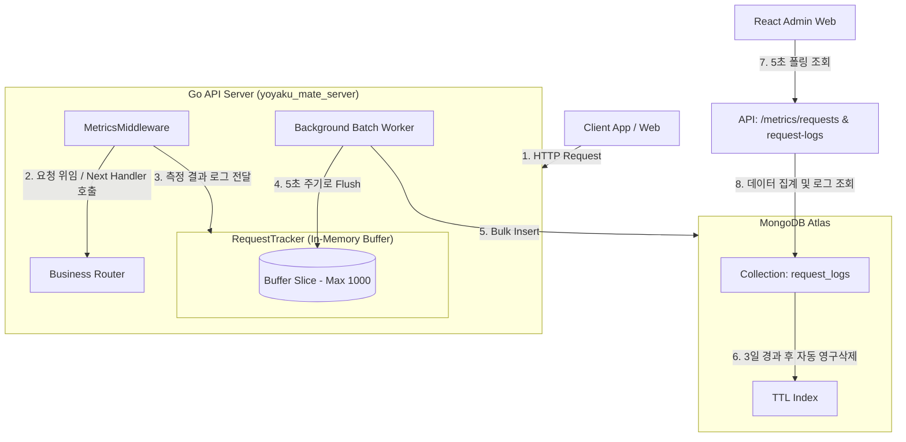

# 기능 사양서: 리퀘스트 대시보드 (Request Dashboard)

본 문서는 `yoyaku_mate_server` 백엔드에 구축된 실시간 API 트래픽 수집/모니터링 시스템의 아키텍처 및 세부 사양을 설명합니다.

---

## 1. 아키텍처 다이어그램 (System Flow)

이 시스템은 API 호출 성능에 영향을 미치지 않기 위해 **비동기 인메모리 버퍼링 및 배치 저장 아키텍처**로 구성되어 있습니다.

---

## 2. 세부 사양 및 로직

### 2.1 수집 미들웨어 (`MetricsMiddleware`)
- **수집 대상**: 서버로 들어오는 모든 REST API 요청.
- **수집 정보**:
  - `timestamp`: 요청 처리 완료 시점의 UTC 시간.
  - `path`: API 경로 (Query parameter 제외).
  - `method`: HTTP 메서드 (GET, POST, PUT, DELETE, PATCH 등).
  - `status_code`: 응답 HTTP 상태 코드.
  - `response_time`: 소요 시간 (밀리초, ms 단위).
  - `client_ip`: 요청을 보낸 클라이언트 IP (프록시 통과 시 X-Forwarded-For에서 추출).

### 2.2 인메모리 버퍼 & 배치 처리 (`RequestTracker`)
- **버퍼 제약**: 급격한 트래픽 유입으로 인한 메모리 고갈을 예방하기 위해, 메모리 버퍼 슬라이스의 길이는 최대 1,000개로 상한을 둡니다.
- **비동기 배치 워커**: 백그라운드 고루틴에서 5초 타이머가 동작하며, 메모리 버퍼에 로그가 존재할 경우 즉시 별도의 DB 연결 세션(Context)을 할당해 MongoDB에 `InsertMany`를 수행하고 버퍼를 초기화합니다.

### 3.3 MongoDB 인덱스 및 스토리지 최적화
- **TTL 인덱스 (`idx_request_logs_ttl`)**: 
  - 대상 필드: `timestamp`
  - 설정값: 3일 (259,200초) 후 만료.
  - 목적: 무한한 로그 적재로 인한 MongoDB Atlas 스토리지 용량 고갈 및 비용 상승 리스크 방지.
- **인덱스 (`idx_request_logs_timestamp`)**:
  - 대상 필드: `timestamp` (내림차순, -1)
  - 목적: 어드민 최신 로그 조회 및 Aggregation 집계 성능 고도화.

---

## 3. 통계 연산 및 API 스펙

### 3.1 통계 메트릭 API (`/api/admin/metrics/requests`)
최근 24시간 범위의 리퀘스트 통계 요약 데이터를 반환합니다.
- **Total Requests (24H)**: `timestamp >= 현재시간 - 24시간` 문서 개수 카운트.
- **Success Rate (24H)**: 성공 문서(Status < 400) / 전체 문서 * 100 연산.
- **Peak TPS (1H)**: 최근 1시간 이내의 문서를 초 단위로 Grouping하여, 그중 가장 요청이 밀집되었던 초당 요청 건수의 최댓값 산출 (MongoDB Aggregation 사용).

### 3.2 상세 로그 API (`/api/admin/metrics/request-logs`)
최근 유입된 로그 50개를 내림차순(최신순)으로 정렬하여 상세 목록을 반환합니다.

---

## 4. 설계 선택 이유

- **배치 저장 방식 채택**: 모든 API 요청마다 MongoDB에 즉각 동기 저장하지 않고, 5초 주기의 배치 저장 방식을 채택함.
  - **이유**: DB Write 횟수를 줄여 메인 비즈니스 API들의 응답 지연(Latency)을 최소화하기 위함임.
  - **단점**: 최대 5초간 로그가 서버 메모리에만 존재하므로, 서버 다운이나 갑작스러운 장애 발생 시 메모리에 적재된 일부 로그가 유실될 수 있음.
  - **결정**: 본 기능은 결제나 예약 정보와 같이 데이터 정합성이 필수적인 기능이 아닌 '운영 모니터링 및 트래픽 분석' 목적이므로, 이 정도의 로그 유실 가능성은 시스템 안전성과 성능 확보를 위해 허용 가능한 타당한 범위라고 판단함.

---

## 5. 향후 고도화 계획 (그래프 시각화)
- **차트 라이브러리 도입**: 추후 React 어드민(`rusui-admin`)에 `Recharts` 라이브러리를 추가 설치하여, 시간에 따른 TPS 트렌드 선 그래프(Line Chart) 및 상태 코드별 성공/실패 비율 도넛 차트(Donut Chart) 시각화 피쳐 개발 예정.

---

## 6. 관련 의사결정 문서 (ADR)
- [ADR-003: 자체 메트릭 수집 및 리퀘스트 카운터 아키텍처 채택](../decisions/ADR-003-request-counter-architecture.ko.md)
