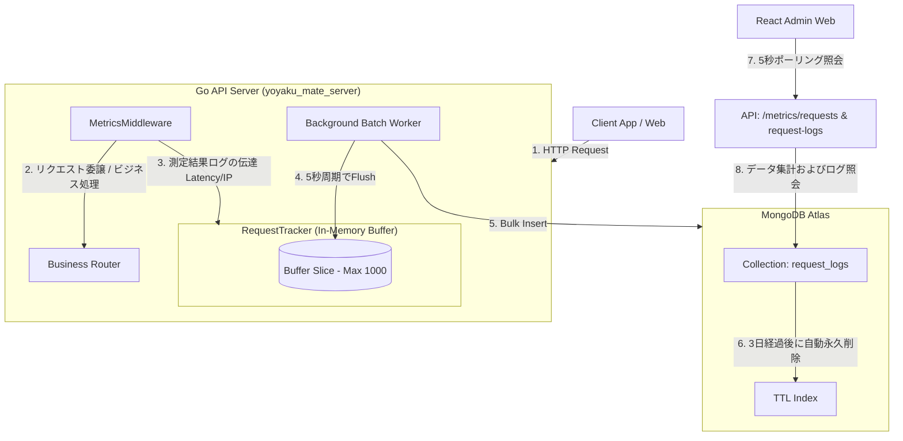

# 機能仕様書：リクエストダッシュボード (Request Dashboard)

本書は、`yoyaku_mate_server` バックエンドに構築されたリアルタイムAPIトラフィック収集・監視システムのアーキテクチャおよび詳細仕様について説明します。

---

## 1. アーキテクチャダイアグラム (System Flow)

本システムは、API呼び出しのパフォーマンスに影響を与えないよう、**非同期インメモリバッファリングおよびバッチ保存アーキテクチャ**で構成されています。

---

## 2. 詳細仕様およびロジック

### 2.1 収集ミドルウェア (`MetricsMiddleware`)
- **収集対象**: サーバーに流入するすべてのREST APIリクエスト。
- **収集情報**:
  - `timestamp`: リクエスト処理完了時のUTC時刻。
  - `path`: APIパス（クエリパラメータは除く）。
  - `method`: HTTPメソッド（GET、POST、PUT、DELETE、PATCHなど）。
  - `status_code`: 応答HTTPステータスコード。
  - `response_time`: 所要時間（ミリ秒、ms単位）。
  - `client_ip`: リクエストを送信したクライアントIP（プロキシ経由時はX-Forwarded-Forから抽出）。

### 2.2 インメモリバッファとバッチ処理 (`RequestTracker`)
- **バッファ制限**: 急激なトラフィック増加に伴うメモリ枯渇を防ぐため、メモリバッファスライスの最大長は1,000件に制限。
- **非同期バッチワーカー**: バックグラウンドのGoroutineで5秒タイマーが動作し、メモリバッファにログが存在する場合、即座に個別のDB接続セッション（Context）を割り当ててMongoDBに`InsertMany`を実行し、バッファを初期化。

### 3.3 MongoDBインデックスとストレージ最適化
- **TTLインデックス (`idx_request_logs_ttl`)**: 
  - 対象フィールド: `timestamp`
  - 設定値: 3日間（259,200秒）で自動削除。
  - 目的: 無制限のログ蓄積に伴うMongoDB Atlasのストレージ容量枯渇およびコスト上昇リスクの防止。
- **インデックス (`idx_request_logs_timestamp`)**:
  - 対象フィールド: `timestamp` (降順, -1)
  - 目的: 管理者画面での最新ログ照会およびAggregation集計のパフォーマンス向上。

---

## 3. 統計演算およびAPI仕様

### 3.1 統計メトリクスAPI (`/api/admin/metrics/requests`)
過去24時間の範囲におけるリクエスト統計の要約データを返却します。
- **Total Requests (24H)**: `timestamp >= 現在時刻 - 24時間` のドキュメント件数をカウント。
- **Success Rate (24H)**: 成功ドキュメント(Status < 400) / 全ドキュメント * 100 を演算。
- **Peak TPS (1H)**: 直近1時間以内のドキュメントを秒単位でGroupingし、その中で最もリクエストが集中した秒間要求件数の最大値を算出（MongoDBのAggregationを使用）。

### 3.2 詳細ログAPI (`/api/admin/metrics/request-logs`)
直近に流入したログ50件を降順（最新順）にソートして詳細リストを返却します。

---

## 4. 設計選択の理由

- **バッチ保存方式の採用**: すべてのAPIリクエストごとにMongoDBへ即座に同期保存するのではなく、5秒周期のバッチ保存方式を採用。
  - **理由**: DBへの書き込み(Write)回数を減らし、メインのビジネスAPIの応答遅延(レイテンシ)を最小限に抑えるため。
  - **デメリット**: 最大5秒間ログがサーバーメモリ上のみに存在するため、サーバーの突然のダウンや障害発生時に、メモリに蓄積された一部のログが消失する可能性がある。
  - **決定**: 本機能は決済や予約情報のようにデータ整合性が必須となる機能ではなく、「運営監視およびトラフィック分析」目的であるため、システム安全性と性能確保を優先し、この程度のログ消失リスクは許容可能な範囲であると判断。

---

## 5. 今後の高度化計画 (グラフ可視化)
- **チャートライブラリの導入**: 将来的にReact管理者画面（`rusui-admin`）に`Recharts`ライブラリを追加インストールし、時間経過に伴うTPSトレンドを示す折れ線グラフ（Line Chart）や、ステータスコード別の成功/失敗比率を示すドーナツチャート（Donut Chart）の可視化機能を開発予定。

---

## 6. 関連の決定事項ドキュメント (ADR)
- [ADR-003: 独自メトリクス収集およびリクエストカウンターアーキテクチャの採用](../decisions/ADR-003-request-counter-architecture.md)
