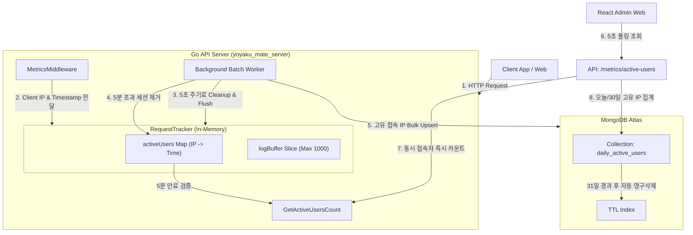

# 구현 상세서: 활성 사용자 트래킹 (Active User Tracking)

본 문서는 `yoyaku_mate_server` Go 백엔드 서버에서 구현된 실시간 동시 접속자 수 및 DAU/MAU 집계 아키텍처와 구현 세부사항을 설명합니다.

> 작성일: 2026-07-14  
> 관련 문서: [활성 사용자 기능 사양서](../features/active-user-dashboard.ko.md), [ADR-004: 활성 사용자 트래킹 의사결정 문서](../decisions/ADR-004-active-user-tracking.ko.md)

---

## 1. 아키텍처 및 데이터 흐름 (System Flow)

이 시스템은 API 성능에 지장을 주지 않기 위해 **인메모리 트래킹(동시 접속자용)** 및 **비동기 벌크 적재(DAU/MAU용)** 혼합 아키텍처를 차용하고 있습니다.



---

## 2. 데이터베이스 설계 (Database Schema)

### 2.1 `daily_active_users` 컬렉션
하루에 유저당 딱 1개의 도큐먼트만 적재되어, 중복 조회를 최소화하고 스토리지 소모량을 최적화합니다.

```javascript
{
  "_id": ObjectId("..."),
  "date": "2026-07-14",
  "client_ip": "203.0.113.195",
  "timestamp": ISODate("2026-07-14T11:45:00Z")
}
```

### 2.2 인덱스 구성
* **31일 만료 TTL 인덱스**: `timestamp` 필드 기준 31일(`2,678,400`초) 경과 시 데이터 자동 삭제 (`idx_dau_ttl`).
* **복합 유니크 인덱스**: `date` + `client_ip` 유니크 설정 (`idx_date_ip`)으로 동일 날짜에 동일 IP는 1번만 입력되도록 강제.

---

## 3. 백엔드 구현 상세 (`yoyaku_mate_server`)

### 3.1 5분 슬라이딩 윈도우 및 정리 (Eviction)
- `RequestTracker` 내에 `activeUsers map[string]time.Time` 자료구조를 두어 사용자 접속 시각을 기록합니다.
- 5초 주기 백그라운드 워커에서 `cleanupActiveUsers()` 함수가 실행되어 `time.Now() - last_active > 5분`인 IP를 맵에서 삭제(`delete`)해 메모리 누수를 방지합니다.

---

## 4. API 사양서 (API Specification)

### 4.1 활성 사용자 요약 지표 조회
* **Endpoint**: `GET /api/admin/metrics/active-users`
* **Headers**: `Authorization: Bearer <token>`
* **Response (200 OK)**:
  ```json
  {
    "current_active_users": 12,
    "daily_active_users": 1420,
    "monthly_active_users": 42080
  }
  ```
* **예외 및 폴백**: DB 조회 에러 등 예외 발생 시, API 전체 500 장애를 차단하기 위해 오류 로그만 출력하고 `current_active_users` 값을 활용하여 논리적으로 계산된 폴백 값을 정상 응답(200)으로 제공합니다.

---

## 관련 문서
- [기능 사양서: 활성 사용자 대시보드](../features/active-user-dashboard.ko.md)
- [ADR-004: 인메모리 슬라이딩 윈도우 및 일별 활성 사용자 컬렉션을 활용한 접속자 트래킹](../decisions/ADR-004-active-user-tracking.ko.md)
- [트러블슈팅: 002-active-user-ip-port-issue](../troubles/002-active-user-ip-port-issue.ko.md)

