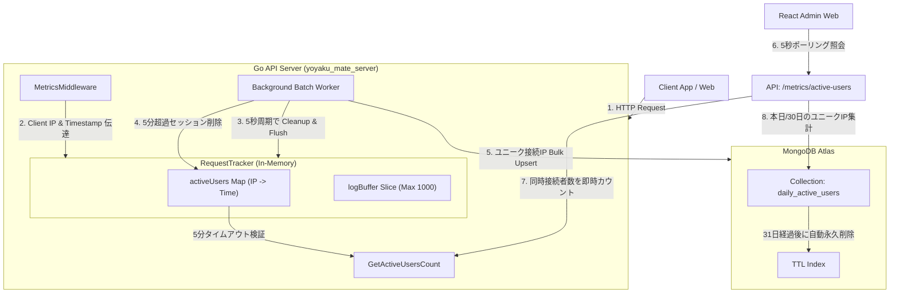

# 実装詳細書: アクティブユーザートラッキング (Active User Tracking)

本文書は、`yoyaku_mate_server` Go バックエンドサーバーにおけるリアルタイム同時接続者数およびDAU/MAU集計アーキテクチャと実装詳細について説明します。

> 作成日: 2026-07-14  
> 関連文書: [アクティブユーザー機能仕様書](../features/active-user-dashboard.md), [ADR-004: アクティブユーザートラッキング意思決定文書](../decisions/ADR-004-active-user-tracking.md)

---

## 1. アーキテクチャおよびデータフロー (System Flow)

本システムは、APIのパフォーマンスに悪影響を与えないよう、**インメモリトラッキング（同時接続者用）**および**非同期バルク蓄積（DAU/MAU用）**のハイブリッドアーキテクチャを採用しています。



---

## 2. データベース設計 (Database Schema)

### 2.1 `daily_active_users` コレクション
1日にユーザーあたり最大1つのドキュメントのみが蓄積され、重複クエリを最小限に抑え、ストレージ消費量を最適化します。

```javascript
{
  "_id": ObjectId("..."),
  "date": "2026-07-14",
  "client_ip": "203.0.113.195",
  "timestamp": ISODate("2026-07-14T11:45:00Z")
}
```

### 2.2 インデックス構成
* **31日期限切れ TTL インデックス**: `timestamp` フィールド基準で31日（`2,678,400`秒）経過時にデータを自動削除（`idx_dau_ttl`）。
* **複合ユニークインデックス**: `date` + `client_ip` のユニーク設定（`idx_date_ip`）により、同一日に同一IPは1回のみ登録されるよう制限。

---

## 3. バックエンド実装詳細 (`yoyaku_mate_server`)

### 3.1 5分スライディングウィンドウおよびクリア (Eviction)
- `RequestTracker` 内に `activeUsers map[string]time.Time` データ構造を保持し、ユーザーの最終アクセス時刻を記録します。
- 5秒周期のバックグラウンドワーカーで `cleanupActiveUsers()` 関数が実行され、`time.Now() - last_active > 5分` であるIPをマップから削除（`delete`）してメモリリークを防止します。

---

## 4. API 仕様書 (API Specification)

### 4.1 アクティブユーザーサマリー指標の照会
* **Endpoint**: `GET /api/admin/metrics/active-users`
* **Headers**: `Authorization: Bearer <token>`
* **Response (200 OK)**:
  ```json
  {
    "current_active_users": 12,
    "daily_active_users": 1420,
    "monthly_active_users": 42080
  }
  ```
* **例外およびフォールバック**: DB照会エラーなどの例外発生時、API全体の500エラー障害を防止するため、エラーログを出力した上で、`current_active_users` の値を活用して論理的に計算されたフォールバック値を正常応答（200 OK）として返却します。

---

## 関連ドキュメント
- [機能仕様書: アクティブユーザーダッシュボード](../features/active-user-dashboard.md)
- [ADR-004: インメモリのスライディングウィンドウおよび日別アクティブユーザーコレクションを活用した接続者トラッキング](../decisions/ADR-004-active-user-tracking.md)
- [トラブルシューティング: 002-active-user-ip-port-issue](../troubles/002-active-user-ip-port-issue.md)

