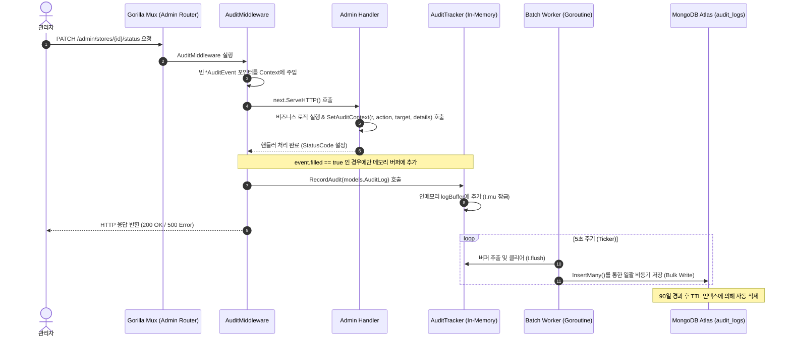

# 구현 상세서: 감사 로그 (Audit Log)

본 문서는 `yoyaku_mate_server`에 구현된 관리자 감사 로그 (Audit Log) 파이프라인의 기술적 설계 및 구현 상세를 설명합니다.

> 작성일: 2026-07-22  
> 관련 문서: [감사 로그 기능 사양서](../features/audit-log.ko.md)

---

## 1. 아키텍처 및 데이터 흐름 (System Flow)

메인 핸들러 처리 성능에 영향을 주지 않도록 Pointer 기반 `context.Context` 공유와 비동기 배치 쓰기 아키텍처를 적용했습니다.



---

## 2. 구성 요소별 구현 상세 (Component Details)

### 2.1 Pointer 기반 Context 포인터 공유 (`metrics/audit_middleware.go`)

핸들러는 응답 상태 코드(SUCCESS / FAILED)를 직접 확정할 수 없으므로, 미들웨어와 Context를 통해 포인터를 공유합니다.

```go
type AuditEvent struct {
    Action  string
    Target  string
    Details string
    filled  bool
}

func SetAuditContext(r *http.Request, action, target, details string) {
    event, ok := r.Context().Value(auditContextKey).(*AuditEvent)
    if !ok || event == nil {
        return
    }
    event.Action = action
    event.Target = target
    event.Details = details
    event.filled = true
}
```

* `event.filled == false`인 경우 단순 GET 조회 요청으로 판단하여 기록을 스킵합니다.
* 응답 완료 시 미들웨어가 `responseWriterWrapper`를 통해 감지한 `statusCode` (>=400 여부)에 따라 `SUCCESS` 또는 `FAILED` 상태를 자동 설정합니다.

### 2.2 비동기 배치 워커 (`metrics/tracker.go` 내 `AuditTracker`)

`ErrorTracker` 및 `RequestTracker`와 동일한 설계 패턴을 따라 싱글톤 + 뮤텍스 + `time.Ticker` (5초) 배치 저장을 채택하고 있습니다.

```go
type AuditTracker struct {
    logBuffer []models.AuditLog
    mu        sync.Mutex
}
```

### 2.3 데이터베이스 설계 (`db/mongo.go`)

#### BSON 스키마 (`audit_logs`)
```json
{
  "_id": "ObjectId",
  "timestamp": "ISODate (UTC)",
  "action": "string (STORE_APPROVED / STORE_REJECTED / STORE_PENDING_REVIEW)",
  "target": "string (작업 대상의 ID 및 설명)",
  "status": "string (SUCCESS / FAILED)",
  "details": "string (승인/반려 사유 코멘트 등 - 선택)"
}
```

#### 인덱스 구성
* **`idx_audit_logs_ttl`**: `timestamp` 필드 기준으로 90일간 (7,776,000초) 보관하고 오래된 로그를 자동 삭제.
* **`idx_audit_logs_timestamp`**: `timestamp: -1` 정렬 인덱스로 최신순 조회 속도를 최적화.

