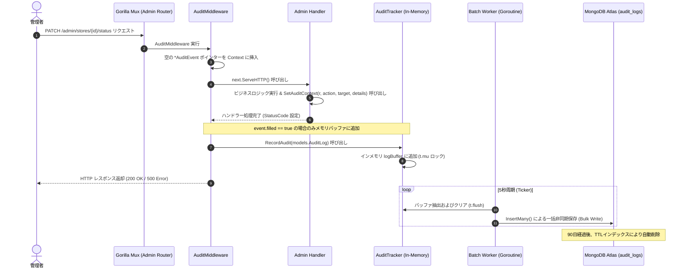

# 実装詳細書: 監査ログ (Audit Log)

本文書は、`yoyaku_mate_server` に実装された管理者監査ログ (Audit Log) パイプラインの技術的設計および実装詳細を説明します。

> 作成日: 2026-07-22  
> 関連文書: [監査ログ機能仕様書](../features/audit-log.md)

---

## 1. アーキテクチャおよびデータフロー (System Flow)

メインのハンドラー処理パフォーマンスに影響を与えないよう、Pointer ベースの `context.Context` 共有と非同期バッチ書き込みアーキテクチャを適用しました。



---

## 2. コンポーネント別実装詳細 (Component Details)

### 2.1 Pointer ベースの Context ポインター共有 (`metrics/audit_middleware.go`)

ハンドラーは応答ステータスコード (SUCCESS / FAILED) を直接確定できないため、ミドルウェアと Context を介してポインターを共有します。

```go
type AuditEvent struct {
    Action  string
    Target  string
    Details string
    filled  bool
}

func SetAuditContext(r *http.Request, action, target, details string) {
    event, ok := r.Context().Value(auditContextKey).(*AuditEvent)
    if !ok || event == nil {
        return
    }
    event.Action = action
    event.Target = target
    event.Details = details
    event.filled = true
}
```

* `event.filled == false` の場合、単なる GET 照会リクエストと判断し、記録をスキップします。
* レスポンス完了時、ミドルウェアが `responseWriterWrapper` を通じてキャッチした `statusCode` (>=400 かどうか) に応じて `SUCCESS` または `FAILED` ステータスを自動設定します。

### 2.2 非同期バッチワーカー (`metrics/tracker.go` 内 `AuditTracker`)

`ErrorTracker` や `RequestTracker` と同一の設計パターンに従い、シングルトン + ミューテックス + `time.Ticker` (5秒) のバッチ保存を採用しています。

```go
type AuditTracker struct {
    logBuffer []models.AuditLog
    mu        sync.Mutex
}
```

### 2.3 データベース設計 (`db/mongo.go`)

#### BSON スキーマ (`audit_logs`)
```json
{
  "_id": "ObjectId",
  "timestamp": "ISODate (UTC)",
  "action": "string (STORE_APPROVED / STORE_REJECTED / STORE_PENDING_REVIEW)",
  "target": "string (操作対象のIDおよび説明)",
  "status": "string (SUCCESS / FAILED)",
  "details": "string (承認/拒否理由コメント等 - 任意)"
}
```

#### インデックス構成
* **`idx_audit_logs_ttl`**: `timestamp` フィールド基準で 90日間 (7,776,000秒) 保持し、古くなったログを自動削除。
* **`idx_audit_logs_timestamp`**: `timestamp: -1` ソートインデックスにより、最新順の取得処理速度を最適化。

