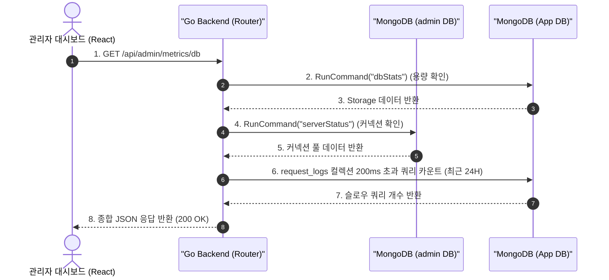

# 구현 상세서: 데이터베이스 메트릭스 모니터링 백엔드 (DB Metrics Backend)

본 문서는 `yoyaku_mate_server`에 구현된 실시간 MongoDB 데이터베이스 성능 트래킹 시스템의 기술적 설계 및 세부 구현사항을 설명합니다.

> 작성일: 2026-07-26  

---

## 1. 아키텍처 및 데이터 흐름 (System Flow)

이 시스템은 별도의 써드파티 모니터링 솔루션(예: Datadog)을 사용하지 않고, **MongoDB Go Driver의 내장 커맨드와 기존 애플리케이션 로그를 활용하여 초경량으로 구축**되었습니다.



---

## 2. 백엔드 구현 상세 (`yoyaku_mate_server`)

### 2.1 사용 라이브러리 및 드라이버
오직 공식 `go.mongodb.org/mongo-driver/mongo`만을 사용하여 성능 오버헤드를 최소화했습니다.

### 2.2 메트릭스 추출 로직 (`handlers/metrics.go`)
- **Active Connections (활성화된 커넥션)**: 
  - `admin` 데이터베이스에 `serverStatus` 명령어를 실행하여 현재 열려있는 커넥션 개수를 파악합니다.
  - 클러스터 모니터링 권한 부족 시 실패할 수 있으므로, 에러 발생 시 시스템을 중단시키지 않고 조용히(Silently) 0으로 처리하도록 예외 처리를 적용했습니다.
- **Database Size (데이터베이스 용량)**: 
  - 현재 앱 데이터베이스에 `dbStats` 명령어를 실행합니다.
  - 반환된 Bytes 데이터를 **MB(메가바이트)** 단위로 환산하고 소수점 둘째 자리에서 반올림하여 반환합니다.
- **Slow Queries (느린 쿼리)**: 
  - 데이터베이스의 프로파일러(Profiler)를 켜서 DB 부하를 발생시키는 대신, 이미 구축되어 있는 **애플리케이션 계층의 `request_logs` 컬렉션을 재활용**합니다.
  - 쿼리 조건: `timestamp` 기준 최근 24시간 && `response_time >= 200ms`

---

## 3. API 사양서 (API Specification)

### 3.1 DB 메트릭스 조회
- **Endpoint**: `GET /api/admin/metrics/db`
- **Auth**: 관리자 전용 미들웨어 적용 대상
- **Response (200 OK)**:
  ```json
  {
    "status": "success",
    "data": {
      "active_connections": 7,
      "database_size_mb": 4.25,
      "slow_queries_24h": 1
    }
  }
  ```
