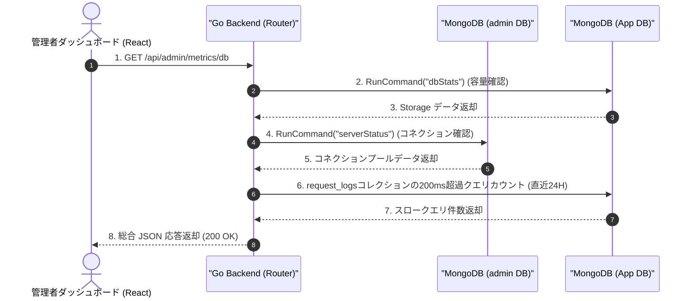

# 実装詳細書：データベースメトリクス監視バックエンド (DB Metrics Backend)

本書は `yoyaku_mate_server` に実装されたリアルタイム MongoDB データベースパフォーマンス追跡システムの技術的設計および詳細な実装事項を説明します。

> 作成日: 2026-07-26  

---

## 1. アーキテクチャおよびデータフロー (System Flow)

このシステムはサードパーティの監視ソリューション（例：Datadog）を使用せず、**MongoDB Go Driverの組み込みコマンドと既存のアプリケーションログを活用して超軽量で構築**されました。



---

## 2. バックエンド実装詳細 (`yoyaku_mate_server`)

### 2.1 使用ライブラリおよびドライバ
公式の `go.mongodb.org/mongo-driver/mongo` のみを使用し、パフォーマンスオーバーヘッドを最小限に抑えました。

### 2.2 メトリクス抽出ロジック (`handlers/metrics.go`)
- **Active Connections (アクティブなコネクション)**: 
  - `admin` データベースに `serverStatus` コマンドを実行し、現在開いているコネクション数を把握します。
  - クラスタ監視権限の不足により失敗する可能性があるため、エラー発生時にシステムを停止させず、静かに(Silently) 0として処理するよう例外処理を適用しました。
- **Database Size (データベース容量)**: 
  - 現在のアプリデータベースに `dbStats` コマンドを実行します。
  - 返却された Bytes データを **MB（メガバイト）** 単位に換算し、小数点第2位で四捨五入して返却します。
- **Slow Queries (スロークエリ)**: 
  - データベースのプロファイラ (Profiler) を有効にして DB 負荷を発生させる代わりに、すでに構築されている**アプリケーション層の `request_logs` コレクションを再利用**します。
  - クエリ条件: `timestamp` 基準で直近24時間 && `response_time >= 200ms`

---

## 3. API 仕様書 (API Specification)

### 3.1 DB メトリクス照会
- **Endpoint**: `GET /api/admin/metrics/db`
- **Auth**: 管理者専用ミドルウェア適用対象
- **Response (200 OK)**:
  ```json
  {
    "status": "success",
    "data": {
      "active_connections": 7,
      "database_size_mb": 4.25,
      "slow_queries_24h": 1
    }
  }
  ```
