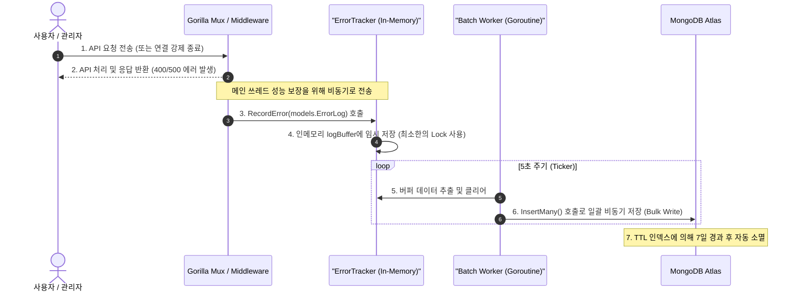

# 구현 상세서: 에러 대시보드 (Error Dashboard)

본 문서는 `yoyaku_mate_server` 및 `yoyaku_mate_admin`에 구현된 실시간 에러 트래킹 시스템의 기술적 설계 및 세부 구현사항을 설명합니다.

> 작성일: 2026-07-14  
> 관련 문서: [에러 대시보드 기능 사양서](../features/error-dashboard.ko.md), [ADR-002: 에러 대시보드 내 HTTP 폴링 방식 채택](../decisions/ADR-002-use-polling-for-error-dashboard.ko.md)

---

## 1. 아키텍처 및 데이터 흐름 (System Flow)

메인 비즈니스 API들의 성능 보장을 위해 비동기 백그라운드 배치 쓰기 아키텍처를 적용했습니다.



---

## 2. 데이터베이스 설계 (Database Schema)

### 2.1 `error_logs` 컬렉션 구조 (BSON)
```json
{
  "_id": "ObjectId",
  "timestamp": "ISODate (UTC)",
  "error_type": "string (500_INTERNAL_ERROR / 400_BAD_REQUEST / DATABASE_ERROR / SSE_DISCONNECT)",
  "message": "string (에러 요약 메시지)",
  "path": "string (API 엔드포인트 경로)",
  "method": "string (GET / POST / PATCH / DELETE)",
  "client_ip": "string (IPv4 / IPv6 또는 프록시 헤더 최초 값)"
}
```

### 2.2 인덱스 구성
* **`idx_error_logs_ttl`**: `timestamp` 필드 기준 7일(`604,800`초) 경과 시 자동 삭제하여 용량 최소화.
* **`idx_error_type`**: `error_type` 필드 단방향 인덱스로 대시보드 로딩 시 카운팅 속도 극대화.

---

## 3. 프론트엔드 구현 상세 (`yoyaku_mate_admin`)

### 3.1 MUI Grid v2 반응형 사이즈 바인딩
Grid v2의 `size` 프로퍼티를 적용하여 데스크톱(4열), 태블릿(2열), 모바일(1열) 반응형 레이아웃을 구현했습니다.
```jsx
<Grid size={{ xs: 12, md: 6, lg: 3 }}>
  <Card>...</Card>
</Grid>
```

### 3.2 5초 실시간 데이터 폴링 및 봉투 해제
* React `useEffect` 내 `setInterval`을 통한 5초 주기 폴링 구현.
* API 연동 시 `{ status: "success", data: ... }` 봉투를 해제하여 `response.data?.data || response.data` 형태로 데이터 리액트 훅으로 매핑.

---

## 4. API 사양서 (API Specification)

### 4.1 에러 통계 요약 조회
* **Endpoint**: `GET /api/admin/metrics/errors`
* **Response (200 OK)**:
  ```json
  {
    "500_INTERNAL_ERROR": 2,
    "400_BAD_REQUEST": 15,
    "DATABASE_ERROR": 0,
    "SSE_DISCONNECT": 4
  }
  ```

### 4.2 최근 상세 에러 로그 목록 조회
* **Endpoint**: `GET /api/admin/metrics/error-logs`
* **Response (200 OK)**:
  ```json
  [
    {
      "id": "60c72b2f9b1d8b2d88c2901a",
      "timestamp": "2026-07-14T11:45:00Z",
      "error_type": "500_INTERNAL_ERROR",
      "message": "connection timed out",
      "path": "/api/waiting-list",
      "method": "POST",
      "client_ip": "203.0.113.195"
    }
  ]
  ```

---

## 관련 문서
- [기능 사양서: 에러 대시보드](../features/error-dashboard.ko.md)
- [ADR-002: 에러 대시보드 내 HTTP 폴링 방식 채택](../decisions/ADR-002-use-polling-for-error-dashboard.ko.md)
