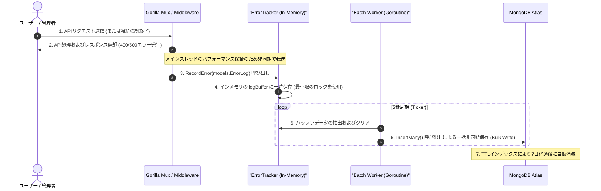

# 実装詳細書: エラーダッシュボード (Error Dashboard)

本文書は、`yoyaku_mate_server` および `yoyaku_mate_admin` に実装されたリアルタイムエラー追跡システムの技術的設計および詳細な実装事項を説明します。

> 作成日: 2026-07-14  
> 関連文書: [エラーダッシュボード機能仕様書](../features/error-dashboard.md), [ADR-002: エラーダッシュボード内HTTPポーリング方式採用](../decisions/ADR-002-use-polling-for-error-dashboard.md)

---

## 1. アーキテクチャおよびデータフロー (System Flow)

メインビジネスAPIのパフォーマンスを保証するため、非同期バックグラウンドバッチ書き込みアーキテクチャを適用しました。



---

## 2. データベース設計 (Database Schema)

### 2.1 `error_logs` コレクション構造 (BSON)
```json
{
  "_id": "ObjectId",
  "timestamp": "ISODate (UTC)",
  "error_type": "string (500_INTERNAL_ERROR / 400_BAD_REQUEST / DATABASE_ERROR / SSE_DISCONNECT)",
  "message": "string (エラー要約メッセージ)",
  "path": "string (APIエンドポイントパス)",
  "method": "string (GET / POST / PATCH / DELETE)",
  "client_ip": "string (IPv4 / IPv6 またはプロキシヘッダーの最初の値)"
}
```

### 2.2 インデックス構成
* **`idx_error_logs_ttl`**: `timestamp` フィールド基準で7日（`604,800`秒）経過時に自動削除し、容量を最小化。
* **`idx_error_type`**: `error_type` フィールドの一方向インデックスにより、ダッシュボード読み込み時のカウント処理速度を最大化。

---

## 3. フロントエンド実装詳細 (`yoyaku_mate_admin`)

### 3.1 MUI Grid v2 レスポンシブサイズバインディング
Grid v2の `size` プロパティを適用し、デスクトップ（4列）、タブレット（2列）、モバイル（1列）のレスポンシブレイアウトを実装しました。
```jsx
<Grid size={{ xs: 12, md: 6, lg: 3 }}>
  <Card>...</Card>
</Grid>
```

### 3.2 5秒リアルタイムデータポーリングとエンベロープ解除
* React `useEffect` 内の `setInterval` を通じた5秒周期のポーリング実装。
* API連携時、`{ status: "success", data: ... }` エンベロープを解除し、 `response.data?.data || response.data` 形式でReact状態にマッピング。

---

## 4. API 仕様書 (API Specification)

### 4.1 エラー統計サマリーの照会
* **Endpoint**: `GET /api/admin/metrics/errors`
* **Response (200 OK)**:
  ```json
  {
    "500_INTERNAL_ERROR": 2,
    "400_BAD_REQUEST": 15,
    "DATABASE_ERROR": 0,
    "SSE_DISCONNECT": 4
  }
  ```

### 4.2 直近の個別エラーログ一覧の照会
* **Endpoint**: `GET /api/admin/metrics/error-logs`
* **Response (200 OK)**:
  ```json
  [
    {
      "id": "60c72b2f9b1d8b2d88c2901a",
      "timestamp": "2026-07-14T11:45:00Z",
      "error_type": "500_INTERNAL_ERROR",
      "message": "connection timed out",
      "path": "/api/waiting-list",
      "method": "POST",
      "client_ip": "203.0.113.195"
    }
  ]
  ```

---

## 関連ドキュメント
- [機能仕様書: エラーダッシュボード](../features/error-dashboard.md)
- [ADR-002: エラーダッシュボードにおけるHTTPポーリング採用の理由](../decisions/ADR-002-use-polling-for-error-dashboard.md)
