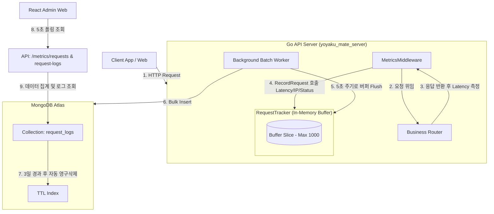

# 구현 상세서: 리퀘스트 카운터 (Request Counter)

본 문서는 `yoyaku_mate_server` Go 백엔드 서버에서의 실시간 API 트래픽 모니터링 수집 아키텍처와 구현 세부사항을 설명합니다.

> 작성일: 2026-07-14  
> 관련 문서: [리퀘스트 대시보드 기능 사양서](../features/request-counter.ko.md), [ADR-003: 자체 메트릭 수집 및 리퀘스트 카운터 아키텍처 채택](../decisions/ADR-003-request-counter-architecture.ko.md)

---

## 1. 아키텍처 및 데이터 흐름 (System Flow)

이 시스템은 API 호출 성능에 영향을 미치지 않기 위해 **비동기 인메모리 버퍼링 및 배치 저장 아키텍처**로 구성되어 있습니다.



---

## 2. 데이터베이스 설계 (Database Schema)

### 2.1 `request_logs` 컬렉션 구조 (BSON)
```json
{
  "_id": "ObjectId",
  "timestamp": "ISODate (UTC)",
  "path": "string (API 엔드포인트 경로)",
  "method": "string (GET / POST / PATCH / DELETE)",
  "status_code": "int (HTTP 응답 코드)",
  "latency_ms": "int (응답 소요 시간, 밀리초 단위)",
  "client_ip": "string (IPv4 / IPv6 또는 프록시 헤더 최초 값)"
}
```

### 2.2 인덱스 구성
* **`idx_request_logs_ttl`**: `timestamp` 필드 기준 3일(`259,200`초) 경과 시 자동 삭제되도록 TTL 인덱스 생성하여 스토리지 낭비 차단.
* **`idx_request_logs_timestamp`**: `timestamp` 인덱스로 대시보드 통계 집계 쿼리 최적화.

---

## 3. 백엔드 구현 상세 (`yoyaku_mate_server`)

### 3.1 HTTP 미들웨어 및 인메모리 버퍼링
* Go `MetricsMiddleware`에서 모든 HTTP API 유입 트래픽의 Latency 및 Client IP를 측정합니다.
* 응답 지연을 방지하기 위해 매 요청을 DB에 동기식으로 기록하지 않고, `RequestTracker`의 메모리 버퍼 슬라이스(최대 1,000개 한도)에 스레드 세이프하게 담아 둡니다.

### 3.2 비동기 배치 벌크 인서트
* 백그라운드 고루틴 워커가 **5초 주기**로 인메모리 버퍼를 비우고, 수집된 로그를 MongoDB의 `request_logs` 컬렉션에 `InsertMany`를 통해 벌크 인서트(Bulk Insert)합니다.

---

## 4. API 사양서 (API Specification)

### 4.1 리퀘스트 집계 및 메트릭 조회
* **Endpoint**: `GET /api/admin/metrics/requests`
* **Response (200 OK)**:
  ```json
  {
    "total_requests": 14050,
    "success_rate": 99.8,
    "peak_tps": 12
  }
  ```

### 4.2 최근 상세 리퀘스트 로그 목록 조회
* **Endpoint**: `GET /api/admin/metrics/request-logs`
* **Response (200 OK)**:
  ```json
  [
    {
      "id": "60c72b2f9b1d8b2d88c2901a",
      "timestamp": "2026-07-14T11:45:00Z",
      "path": "/api/waiting-list",
      "method": "POST",
      "status_code": 200,
      "latency_ms": 25,
      "client_ip": "203.0.113.195"
    }
  ]
  ```

---

## 관련 문서
- [기능 사양서: 리퀘스트 카운터](../features/request-counter.ko.md)
- [ADR-003: 자체 메트릭 수집 및 리퀘스트 카운터 아키텍처 채택](../decisions/ADR-003-request-counter-architecture.ko.md)
