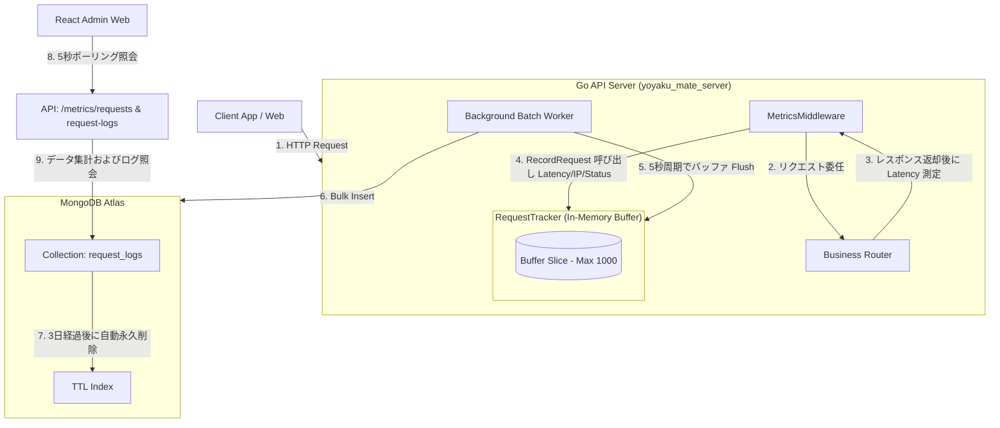

# 実装詳細書: リクエストカウンター (Request Counter)

本文書は、`yoyaku_mate_server` Go バックエンドサーバーにおけるリアルタイムAPIトラフィックモニタリング収集アーキテクチャと実装詳細について説明します。

> 作成日: 2026-07-14  
> 関連文書: [リクエストダッシュボード機能仕様書](../features/request-counter.md), [ADR-003: 自主メトリクス収集およびリクエストカウンターアーキテクチャ採用](../decisions/ADR-003-request-counter-architecture.md)

---

## 1. アーキテクチャおよびデータフロー (System Flow)

本システムは、API呼び出しパフォーマンスに影響を与えないよう、**非同期インメモリバッファリングおよびバッチ保存アーキテクチャ**で構成されています。



---

## 2. データベース設計 (Database Schema)

### 2.1 `request_logs` コレクション構造 (BSON)
```json
{
  "_id": "ObjectId",
  "timestamp": "ISODate (UTC)",
  "path": "string (APIエンドポイントパス)",
  "method": "string (GET / POST / PATCH / DELETE)",
  "status_code": "int (HTTP応答コード)",
  "latency_ms": "int (応答所要時間、ミリ秒単位)",
  "client_ip": "string (IPv4 / IPv6 またはプロキシヘッダーの最初の値)"
}
```

### 2.2 インデックス構成
* **`idx_request_logs_ttl`**: `timestamp` フィールド基準で3日（`259,200`秒）経過時に自動削除されるようTTLインデックスを作成し、ストレージの浪費を遮断。
* **`idx_request_logs_timestamp`**: `timestamp` インデックスにより、ダッシュボード統計集計クエリを最適化。

---

## 3. バックエンド実装詳細 (`yoyaku_mate_server`)

### 3.1 HTTP ミドルウェアおよびインメモリバッファリング
* Go の `MetricsMiddleware` ですべての HTTP API 流入トラフィックの Latency および Client IP を測定します。
* 応答遅延を防ぐため、リクエストごとにDBへ同期保存せず、 `RequestTracker` のメモリバッファスライス（最大1,000件）にスレッドセーフに格納します。

### 3.2 非同期バッチバルクインサート
* バックグラウンドのゴルーチンワーカーが **5秒周期** でインメモリバッファをクリアし、収集されたログを MongoDB の `request_logs` コレクションに `InsertMany` を通じてバルクインサート（Bulk Insert）します。

---

## 4. API 仕様書 (API Specification)

### 4.1 リクエスト集計およびメトリクス照会
* **Endpoint**: `GET /api/admin/metrics/requests`
* **Response (200 OK)**:
  ```json
  {
    "total_requests": 14050,
    "success_rate": 99.8,
    "peak_tps": 12
  }
  ```

### 4.2 直近の個別リクエストログ一覧の照会
* **Endpoint**: `GET /api/admin/metrics/request-logs`
* **Response (200 OK)**:
  ```json
  [
    {
      "id": "60c72b2f9b1d8b2d88c2901a",
      "timestamp": "2026-07-14T11:45:00Z",
      "path": "/api/waiting-list",
      "method": "POST",
      "status_code": 200,
      "latency_ms": 25,
      "client_ip": "203.0.113.195"
    }
  ]
  ```
