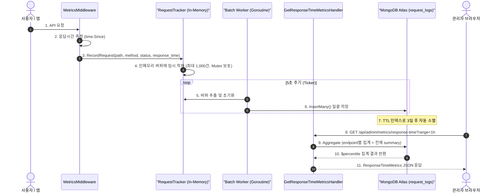

# 구현 상세서: Response Time 대시보드 (Response Time Dashboard)

본 문서는 `yoyaku_mate_server` 및 `yoyaku_mate_admin`에 구현된 API 레이턴시 모니터링 기능의 기술적 설계 및 세부 구현사항을 설명합니다.

> 작성일: 2026-07-20  
> 관련 문서: [기능 사양서: Response Time 대시보드](../features/response-time-dashboard.ko.md)

---

## 1. 아키텍처 및 데이터 흐름 (System Flow)



---

## 2. 데이터베이스 설계 (Database Schema)

### 2.1 `request_logs` 컬렉션 구조 (BSON)

```json
{
  "_id": "ObjectId",
  "timestamp": "ISODate (UTC)",
  "path": "string (API 엔드포인트 경로, 예: /api/waiting-list)",
  "method": "string (GET / POST / PATCH / DELETE)",
  "status_code": "int (HTTP 상태코드)",
  "response_time": "int64 (응답시간, 밀리초)",
  "client_ip": "string (IPv4 또는 X-Forwarded-For 최초 값)"
}
```

### 2.2 인덱스 구성

| 인덱스명 | 필드 | 용도 |
|---|---|---|
| `idx_request_logs_ttl` | `timestamp` | 3일(259,200초) 경과 시 자동 삭제 |
| `idx_request_logs_timestamp` | `timestamp` | Aggregation `$match` 범위 필터 고속화 |

---

## 3. 서버 구현 상세 (`yoyaku_mate_server`)

### 3.1 신규 파일 목록

| 파일 | 역할 |
|---|---|
| `models/response_time.go` | `ResponseTimeMetrics`, `ResponseTimeSummary`, `EndpointLatency` 구조체 정의 |
| `handlers/metrics.go` (추가) | `GetResponseTimeMetricsHandler`, `toFloat64()`, `toInt64()` 헬퍼 추가 |
| `handlers/router.go` (추가) | `GET /api/admin/metrics/response-time` 라우트 등록 |
| `metrics/middleware.go` (수정) | `/api/admin/metrics` 경로 로깅 필터 추가 |

### 3.2 MongoDB Aggregation 설계

`$percentile` 연산자 (MongoDB 7.0 이상, `approximate` 알고리즘)를 활용하여 P95 / P99를 집계합니다.

**엔드포인트별 집계 파이프라인:**

```
$match  →  지정 시간 이후 데이터 필터
$group  →  path + method로 그룹핑
           avg_ms:     $avg(response_time)
           p95_ms:     $percentile(p=[0.95], method="approximate")
           p99_ms:     $percentile(p=[0.99], method="approximate")
           count:      $sum(1)
           error_count: $sum($cond(status_code >= 400, 1, 0))
$sort   →  avg_ms 내림차순
$limit  →  10건
```

**주의**: MongoDB `$percentile`은 단일 `p` 배열을 받아 배열로 반환합니다.
Go 레벨에서 `bson.A` 타입으로 수신 후 첫 번째 요소를 추출합니다.

```go
if arr, ok := raw["p99_ms"].(bson.A); ok && len(arr) > 0 {
    ep.P99Ms = math.Round(toFloat64(arr[0])*10) / 10
}
```

### 3.3 시간 범위 파라미터 처리

`?range=` 쿼리 파라미터로 집계 기준 시간을 동적 결정합니다.

```go
switch rangeParam {
case "5m":  since = time.Now().UTC().Add(-5 * time.Minute)
case "24h": since = time.Now().UTC().Add(-24 * time.Hour)
default:    since = time.Now().UTC().Add(-1 * time.Hour)  // "1h" 또는 미지정
}
```

### 3.4 모니터링 요청 로깅 제외 (오염 방지)

`MetricsMiddleware`에 경로 프리픽스 필터를 추가하여, Admin 폴링 요청이 통계에 포함되지 않도록 처리합니다.

```go
if strings.HasPrefix(r.URL.Path, "/api/admin/metrics") {
    next.ServeHTTP(w, r)  // 핸들러는 정상 실행
    return                 // request_logs 기록만 스킵
}
```

### 3.5 타입 변환 헬퍼

BSON `interface{}`에서 꺼낸 값은 런타임 타입이 불명확하므로, 목적지 타입별 헬퍼 함수로 안전하게 변환합니다.

| 함수 | 용도 |
|---|---|
| `toFloat64(v interface{})` | avg_ms, p95_ms, p99_ms 등 소수점이 있는 값 |
| `toInt64(v interface{})` | count, error_count 등 정수 카운팅 값 |

---

## 4. 프론트엔드 구현 상세 (`yoyaku_mate_admin`)

### 4.1 신규 / 수정 파일 목록

| 파일 | 역할 |
|---|---|
| `src/pages/ResponseTimePage.jsx` | 전면 재작성 (더미 → 실제 API 연동) |
| `src/api/adminService.js` (추가) | `getResponseTimeMetrics(range)` 함수 추가 |

### 4.2 시간 범위 탭 (`ToggleButtonGroup`)

MUI `ToggleButtonGroup`의 인접 버튼 테두리 합치기 기본 동작으로 인해 선택된 버튼의 오른쪽 테두리가 잘리는 문제가 발생합니다.

**해결 방법**: `gap`으로 버튼 간격을 분리하고, `MuiToggleButtonGroup-grouped` 클래스에 `border !important`를 직접 부여하여 각 버튼을 독립 테두리로 처리합니다.

```jsx
sx={{
  gap: 0.75,
  '& .MuiToggleButtonGroup-grouped': {
    border: `1px solid ${COLORS.borderLight} !important`,
    borderRadius: '6px !important',
    mx: 0,
  },
}}
```

### 4.3 색상 동적 적용 로직

```js
// 레이턴시 임계치별 색상
const getLatencyColor = (ms) => {
  if (ms === 0 || !ms) return COLORS.textMuted;
  if (ms < 100)  return COLORS.success;   // 녹색
  if (ms < 500)  return COLORS.warning;   // 주황
  return COLORS.error;                     // 빨강 (≥ 500ms)
};

// 에러율 임계치별 색상 (ERROR RATE 카드 및 테이블 ERROR % 컬럼)
// ≤ 1% → 녹색 / 1~5% → 주황 / > 5% → 빨강
```

### 4.4 5초 폴링 및 범위 연동

`range` 상태 변경 시 즉시 데이터를 재조회하고, 이후 5초 인터벌로 자동 갱신합니다.
`useCallback`으로 `fetchData`를 메모이제이션하여 불필요한 클로저 재생성을 방지합니다.

```jsx
const fetchData = useCallback(async () => { ... }, [range]);

useEffect(() => {
    setLoading(true);
    fetchData();
    const interval = setInterval(fetchData, 5000);
    return () => clearInterval(interval);
}, [fetchData]);
```

---

## 5. API 사양서 (API Specification)

### `GET /api/admin/metrics/response-time`

**Query Parameters:**

| 파라미터 | 타입 | 기본값 | 설명 |
|---|---|---|---|
| `range` | string | `1h` | 집계 범위 (`5m` / `1h` / `24h`) |

**Response (200 OK):**

```json
{
  "summary": {
    "avg_ms": 45.2,
    "p95_ms": 220.0,
    "p99_ms": 850.5,
    "error_rate_pct": 1.2
  },
  "endpoints": [
    {
      "method": "GET",
      "path": "/api/admin/stores",
      "avg_ms": 180.3,
      "p95_ms": 420.0,
      "p99_ms": 850.5,
      "count": 1240,
      "error_pct": 2.1
    }
  ]
}
```

---

## 관련 문서
- [기능 사양서: Response Time 대시보드](../features/response-time-dashboard.ko.md)
