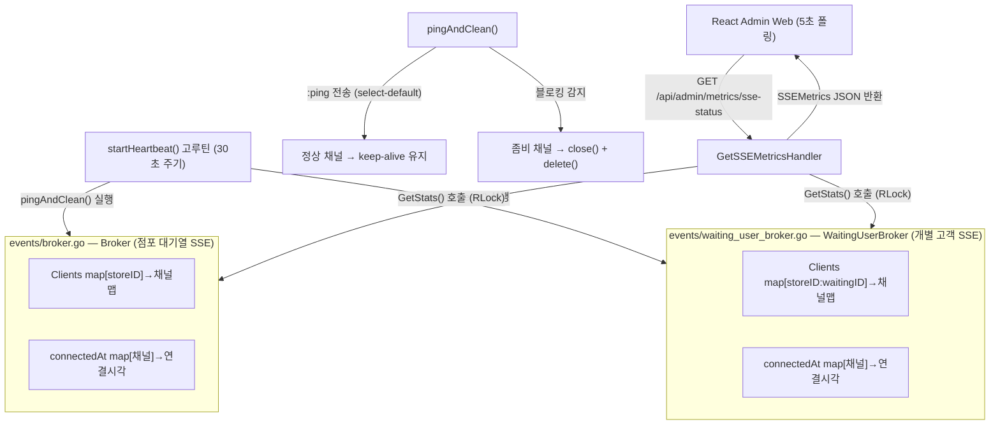

# 구현 상세서: SSE 상태 모니터링 (SSE Status Monitoring)

본 문서는 `yoyaku_mate_server` Go 백엔드 서버에서 구현된 SSE 브로커 연결 현황 모니터링 및 Heartbeat 좀비 연결 제거 아키텍처의 구현 세부사항을 설명합니다.

> 작성일: 2026-07-15  
> 관련 문서: [기능 사양서: SSE 상태 모니터링](../features/sse-monitoring.ko.md), [기능 사양서: SSE 실시간 연결](../features/sse.ko.md)

---

## 1. 아키텍처 및 데이터 흐름 (System Flow)

이 시스템은 **DB 접근 없이 순수 인메모리 조회**만으로 동작하여 응답 속도가 매우 빠릅니다. 좀비 연결 제거는 별도 백그라운드 고루틴으로 처리합니다.



---

## 2. 브로커 구조 변경 (Broker Structure)

### 2.1 `events/broker.go` — `Broker` 구조체

Heartbeat 및 통계 기능을 위해 기존 구조체에 `connectedAt` 맵을 추가했습니다.

```go
type Broker struct {
    // 점포 ID와 클라이언트 채널 목록 맵
    Clients     map[string]map[chan string]bool
    // 각 채널의 연결 시각 기록 (좀비 감지 및 평균 유지 시간 계산용)
    connectedAt map[chan string]time.Time
    Mutex       sync.RWMutex
}
```

### 2.2 `events/waiting_user_broker.go` — `WaitingUserBroker` 구조체

`Broker`와 동일한 패턴으로 `connectedAt` 맵을 추가했습니다.

```go
type WaitingUserBroker struct {
    // key: "storeID:waitingID" → 클라이언트 채널 맵
    Clients     map[string]map[chan string]bool
    // 각 채널의 연결 시각 기록
    connectedAt map[chan string]time.Time
    Mutex       sync.RWMutex
}
```

---

## 3. 백엔드 구현 상세 (`yoyaku_mate_server`)

### 3.1 싱글톤 초기화 및 Heartbeat 고루틴 실행

브로커 싱글톤(`sync.Once`) 초기화 시 `startHeartbeat()` 고루틴이 자동으로 실행됩니다.

```go
func GetBroker() *Broker {
    Once.Do(func() {
        Instance = &Broker{
            Clients:     make(map[string]map[chan string]bool),
            connectedAt: make(map[chan string]time.Time),
        }
        go Instance.startHeartbeat() // 초기화와 동시에 Heartbeat 시작
    })
    return Instance
}
```

### 3.2 `pingAndClean()` — 논블로킹 ping 전송 및 좀비 제거

`select-default` 패턴으로 채널 상태를 논블로킹으로 확인합니다.

```go
func (b *Broker) pingAndClean() {
    b.Mutex.Lock()          // 쓰기 락: Clients 맵 수정이 필요하므로
    defer b.Mutex.Unlock()

    for storeID, clients := range b.Clients {
        for ch := range clients {
            select {
            case ch <- ":ping": // SSE 주석 이벤트 (클라이언트가 수신하지 않음)
            default:            // 채널 블로킹 = 좀비 연결 → 즉시 제거
                delete(clients, ch)
                delete(b.connectedAt, ch)
                close(ch)
            }
        }
        if len(clients) == 0 {
            delete(b.Clients, storeID)
        }
    }
}
```

> **주의**: `pingAndClean()`은 쓰기 락(`Lock()`)을 보유하는 동안 채널 send를 수행합니다.
> 연결 수가 매우 많아지면 Heartbeat 실행 중 `Broadcast()` 호출이 일시 블로킹될 수 있습니다.
> 현재 규모에서는 허용 가능한 수준이며, 트래픽 급증 시 "좀비 목록 수집 → 락 해제 → close()" 분리 방식으로 개선할 수 있습니다.

### 3.3 `GetStats()` — 인메모리 통계 집계

읽기 락(`RLock()`)만 사용하여 `Broadcast()`와 동시 실행이 가능합니다.

```go
func (b *Broker) GetStats() BrokerStats {
    b.Mutex.RLock()
    defer b.Mutex.RUnlock()

    totalConnections := 0
    for _, clients := range b.Clients {
        totalConnections += len(clients)
    }

    var totalUptimeSeconds float64
    now := time.Now()
    for ch, connTime := range b.connectedAt {
        _ = ch
        totalUptimeSeconds += now.Sub(connTime).Seconds()
    }

    var avgUptime float64
    if totalConnections > 0 {
        avgUptime = totalUptimeSeconds / float64(totalConnections)
    }

    return BrokerStats{
        ActiveKeys:       len(b.Clients),
        TotalConnections: totalConnections,
        AvgUptimeSeconds: avgUptime,
    }
}
```

---

## 4. 신규 모델 (`models/sse_metrics.go`)

```go
type SSEBrokerStats struct {
    ActiveKeys       int     `json:"active_keys"`
    TotalConnections int     `json:"total_connections"`
    AvgUptimeSeconds float64 `json:"avg_uptime_seconds"`
}

type SSEMetrics struct {
    StoreBroker       SSEBrokerStats `json:"store_broker"`
    WaitingUserBroker SSEBrokerStats `json:"waiting_user_broker"`
    TotalConnections  int            `json:"total_connections"`
    Health            string         `json:"health"` // "HEALTHY" | "IDLE"
}
```

---

## 5. API 사양서 (API Specification)

### 5.1 SSE 연결 현황 조회

* **Endpoint**: `GET /api/admin/metrics/sse-status`
* **인증**: Admin 라우터(`/api/admin`) 소속 (기존 Admin 인증 정책 동일 적용)
* **처리 시간**: < 1ms (DB 접근 없음, 순수 인메모리 조회)
* **Response (200 OK)**:

```json
{
  "store_broker": {
    "active_keys": 3,
    "total_connections": 7,
    "avg_uptime_seconds": 183.4
  },
  "waiting_user_broker": {
    "active_keys": 12,
    "total_connections": 12,
    "avg_uptime_seconds": 45.2
  },
  "total_connections": 19,
  "health": "HEALTHY"
}
```

---

## 관련 문서
- [기능 사양서: SSE 상태 모니터링](../features/sse-monitoring.ko.md)
- [기능 사양서: SSE 실시간 연결 아키텍처](../features/sse.ko.md)
