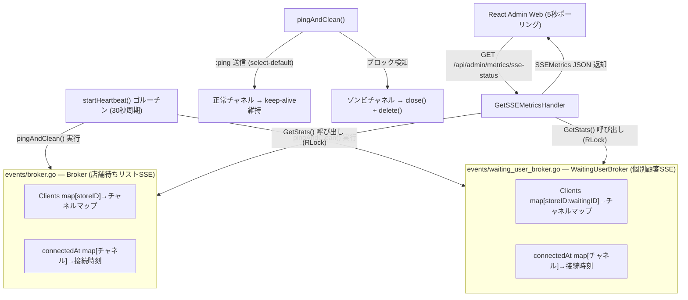

# 実装詳細書: SSE状態監視 (SSE Status Monitoring)

本ドキュメントは、 `yoyaku_mate_server` Goバックエンドサーバーで実装されたSSEブローカー接続状況監視およびHeartbeatゾンビ接続自動削除アーキテクチャの実装詳細を説明します。

> 作成日: 2026-07-15  
> 関連ドキュメント: [機能仕様書: SSE状態監視](../features/sse-monitoring.md), [機能仕様書: SSEリアルタイム接続](./sse.md)

---

## 1. アーキテクチャおよびデータフロー (System Flow)

このシステムは、**DBへのアクセスを伴わず純粋なインメモリ参照のみ**で動作するため、応答速度が非常に高速です。ゾンビ接続の削除はバックグラウンドの別ゴルーチンで処理されます。



---

## 2. ブローカー構造の変更 (Broker Structure)

### 2.1 `events/broker.go` — `Broker` 構造体

Heartbeatおよび統計機能のために、既存の構造体に `connectedAt` マップを追加しました。

```go
type Broker struct {
    // 店舗IDとクライアントチャネルリストのマップ
    Clients     map[string]map[chan string]bool
    // 各チャネルの接続時刻を記録（ゾンビ接続検知および平均維持時間の計算用）
    connectedAt map[chan string]time.Time
    Mutex       sync.RWMutex
}
```

### 2.2 `events/waiting_user_broker.go` — `WaitingUserBroker` 構造体

`Broker` と同様のパターンで `connectedAt` マップを追加しました。

```go
type WaitingUserBroker struct {
    // key: "storeID:waitingID" → クライアントチャネルマップ
    Clients     map[string]map[chan string]bool
    // 各チャネルの接続時刻を記録
    connectedAt map[chan string]time.Time
    Mutex       sync.RWMutex
}
```

---

## 3. バックエンド実装詳細 (`yoyaku_mate_server`)

### 3.1 シングルトン初期化およびHeartbeatゴルーチン起動

ブローカーシングルトン（`sync.Once`）初期化時に `startHeartbeat()` ゴルーチンが自動的に実行されます。

```go
func GetBroker() *Broker {
    Once.Do(func() {
        Instance = &Broker{
            Clients:     make(map[string]map[chan string]bool),
            connectedAt: make(map[chan string]time.Time),
        }
        go Instance.startHeartbeat() // 初期化と同時にHeartbeat開始
    })
    return Instance
}
```

### 3.2 `pingAndClean()` — ノンブロッキングping送信とゾンビ削除

`select-default` パターンを使用して、チャネルの状態をノンブロッキングで判定します。

```go
func (b *Broker) pingAndClean() {
    b.Mutex.Lock()          // 書き込みロック: Clientsマップを操作するため
    defer b.Mutex.Unlock()

    for storeID, clients := range b.Clients {
        for ch := range clients {
            select {
            case ch <- ":ping": // SSE仕様のコメント形式 (クライアント側で処理されない)
            default:            // チャネルブロック = ゾンビ接続 → 即座に削除
                delete(clients, ch)
                delete(b.connectedAt, ch)
                close(ch)
            }
        }
        if len(clients) == 0 {
            delete(b.Clients, storeID)
        }
    }
}
```

> **注意**: `pingAndClean()` は書き込みロック（`Lock()`）を保持した状態でチャネルの送信を試みます。
> 接続数が極めて多くなると、Heartbeat実行中の一時的なロック競合により `Broadcast()` の実行が遅延する可能性があります。
> 現在の規模では許容できるレベルですが、トラフィック急増時には「ゾンビ対象チャネルのリスト収集 → ロック解除 → close()処理」のように分離する実装へ改善可能です。

### 3.3 `GetStats()` — インメモリ統計集計

読み取りロック（`RLock()`）のみを使用し、 `Broadcast()` との同時実行性を確保します。

```go
func (b *Broker) GetStats() BrokerStats {
    b.Mutex.RLock()
    defer b.Mutex.RUnlock()

    totalConnections := 0
    for _, clients := range b.Clients {
        totalConnections += len(clients)
    }

    var totalUptimeSeconds float64
    now := time.Now()
    for ch, connTime := range b.connectedAt {
        _ = ch
        totalUptimeSeconds += now.Sub(connTime).Seconds()
    }

    var avgUptime float64
    if totalConnections > 0 {
        avgUptime = totalUptimeSeconds / float64(totalConnections)
    }

    return BrokerStats{
        ActiveKeys:       len(b.Clients),
        TotalConnections: totalConnections,
        AvgUptimeSeconds: avgUptime,
    }
}
```

---

## 4. 新規データモデル (`models/sse_metrics.go`)

```go
type SSEBrokerStats struct {
    ActiveKeys       int     `json:"active_keys"`
    TotalConnections int     `json:"total_connections"`
    AvgUptimeSeconds float64 `json:"avg_uptime_seconds"`
}

type SSEMetrics struct {
    StoreBroker       SSEBrokerStats `json:"store_broker"`
    WaitingUserBroker SSEBrokerStats `json:"waiting_user_broker"`
    TotalConnections  int            `json:"total_connections"`
    Health            string         `json:"health"` // "HEALTHY" | "IDLE"
}
```

---

## 5. API仕様書 (API Specification)

### 5.1 SSE接続状況の取得

* **Endpoint**: `GET /api/admin/metrics/sse-status`
* **認可**: Adminルーター（`/api/admin`）配下 (既存の管理者認証ポリシーが同一適用されます)
* **レスポンス時間**: < 1ms (DBアクセスなし、純粋なインメモリ集計)
* **Response (200 OK)**:

```json
{
  "store_broker": {
    "active_keys": 3,
    "total_connections": 7,
    "avg_uptime_seconds": 183.4
  },
  "waiting_user_broker": {
    "active_keys": 12,
    "total_connections": 12,
    "avg_uptime_seconds": 45.2
  },
  "total_connections": 19,
  "health": "HEALTHY"
}
```

---

## 関連ドキュメント
- [機能仕様書: SSE状態監視](../features/sse-monitoring.md)
- [機能仕様書: SSEリアルタイム接続](../features/sse.md)
