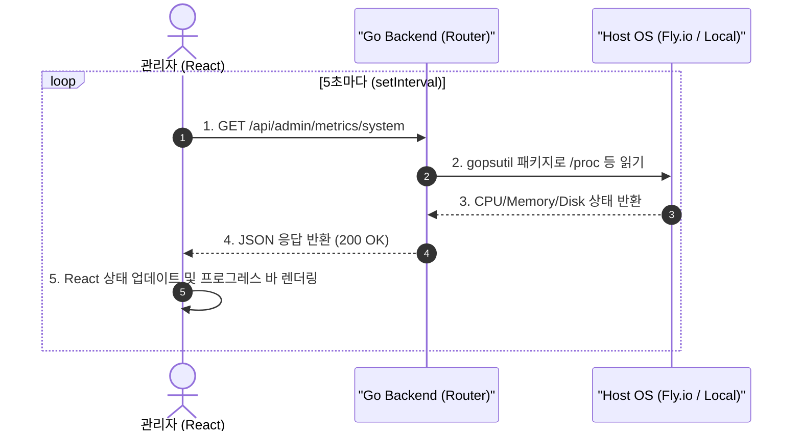

# 구현 상세서: 시스템 메트릭스 대시보드 (System Metrics Dashboard)

본 문서는 `yoyaku_mate_server` 및 `yoyaku_mate_admin`에 구현된 실시간 하드웨어 리소스 트래킹 시스템의 기술적 설계 및 세부 구현사항을 설명합니다.

> 작성일: 2026-07-23  
> 관련 문서: [시스템 메트릭스 기능 사양서](../features/system-metrics-dashboard.ko.md)

---

## 1. 아키텍처 및 데이터 흐름 (System Flow)

이 시스템은 버퍼링이나 데이터베이스에 저장(누적)하는 방식이 아닌, **요청 즉시 OS의 상태를 읽어와 반환**하는 Stateless(무상태) 아키텍처로 구현되었습니다.



---

## 2. 백엔드 구현 상세 (`yoyaku_mate_server`)

### 2.1 사용 라이브러리
OS 종속성 없이(Linux, macOS, Windows 호환) 리소스 사용량을 가져오기 위해 오픈소스 패키지인 `github.com/shirou/gopsutil/v3`를 채택했습니다.
Fly.io 인스턴스(Firecracker 마이크로VM) 환경에서도 컨테이너 내부의 정확한 사용량을 측정할 수 있습니다.

### 2.2 메트릭스 추출 로직 (`handlers/metrics.go`)
- **CPU**: `cpu.Percent(0, false)`를 호출하여 즉시(Non-blocking) CPU 전체 사용량을 반환받습니다.
- **Memory**: `mem.VirtualMemory()`를 호출하여 `UsedPercent`를 추출합니다.
- **Disk**: `disk.Usage("/")`를 호출하여 루트 파일시스템의 `UsedPercent`를 추출합니다.

```go
// 소수점 첫째 자리 반올림 처리 예시
cpuUsage = math.Round(cpuPercents[0]*10) / 10
```

---

## 3. 프론트엔드 구현 상세 (`yoyaku_mate_admin`)

### 3.1 React useEffect 주기적 폴링
SSE(Server-Sent Events) 커넥션을 유지하지 않고, 클라이언트 단에서 `setInterval`을 이용한 폴링(Polling) 방식을 적용했습니다. 이는 백엔드의 메모리 및 연결 리소스를 아끼면서도 충분한 실시간성을 제공합니다.

```javascript
  useEffect(() => {
    fetchMetrics(); // 초기 1회 렌더링 시 즉시 가져오기
    const interval = setInterval(fetchMetrics, 5000); // 5초 주기 폴링
    return () => clearInterval(interval); // 컴포넌트 언마운트 시 정리
  }, []);
```

### 3.2 MUI 기반 프로그레스 바 렌더링
서버 상태를 숫자(%)와 함께 시각화하기 위해 MUI의 `<LinearProgress />` 컴포넌트를 사용했습니다.
위험도를 직관적으로 구분하기 위해 MUI 기본 색상 테마(Primary, Info, Warning)를 다르게 배정했습니다.

---

## 4. API 사양서 (API Specification)

### 4.1 시스템 메트릭스 조회
- **Endpoint**: `GET /api/admin/metrics/system`
- **Response (200 OK)**:
  ```json
  {
    "status": "success",
    "data": {
      "cpuUsage": 14.2,
      "memoryUsage": 45.8,
      "diskSpace": 21.4
    }
  }
  ```

---

## 관련 문서
- [기능 사양서: 시스템 메트릭스 대시보드](../features/system-metrics-dashboard.ko.md)
