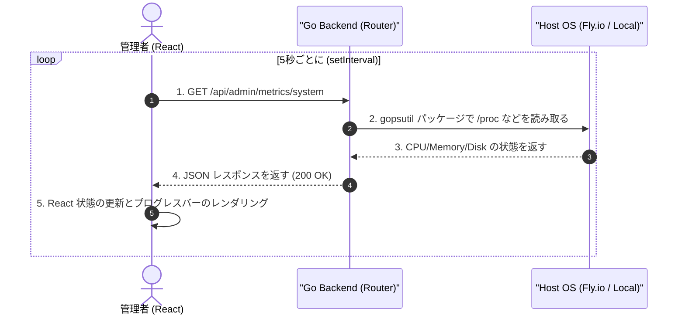

# 実装詳細書: システムメトリクスダッシュボード (System Metrics Dashboard)

本ドキュメントは、`yoyaku_mate_server` および `yoyaku_mate_admin` に実装されたリアルタイムハードウェアリソーストラッキングシステムの技術的な設計と詳細な実装内容を説明します。

> 作成日: 2026-07-23  
> 関連ドキュメント: [システムメトリクス機能仕様書](../features/system-metrics-dashboard.md)

---

## 1. アーキテクチャおよびデータフロー (System Flow)

このシステムは、バッファリングやデータベースへの保存(蓄積)を行う方式ではなく、**要求時に即座にOSの状態を読み取って返す**ステートレス(Stateless)アーキテクチャで実装されています。



---

## 2. バックエンド実装詳細 (`yoyaku_mate_server`)

### 2.1 使用ライブラリ
OS依存なく(Linux、macOS、Windows互換)リソース使用量を取得するために、オープンソースパッケージである `github.com/shirou/gopsutil/v3` を採用しました。
Fly.ioインスタンス(FirecrackerマイクロVM)環境でもコンテナ内部の正確な使用量を測定できます。

### 2.2 メトリクス抽出ロジック (`handlers/metrics.go`)
- **CPU**: `cpu.Percent(0, false)` を呼び出して、即時(Non-blocking)にCPU全体の使用量を取得します。
- **Memory**: `mem.VirtualMemory()` を呼び出して `UsedPercent` を抽出します。
- **Disk**: `disk.Usage("/")` を呼び出してルートファイルシステムの `UsedPercent` を抽出します。

```go
// 小数点第一位で四捨五入する例
cpuUsage = math.Round(cpuPercents[0]*10) / 10
```

---

## 3. フロントエンド実装詳細 (`yoyaku_mate_admin`)

### 3.1 React useEffect による定期的なポーリング
SSE (Server-Sent Events) コネクションを維持するのではなく、クライアント側で `setInterval` を利用したポーリング(Polling)方式を適用しました。これにより、バックエンドのメモリや接続リソースを節約しつつ、十分なリアルタイム性を提供します。

```javascript
  useEffect(() => {
    fetchMetrics(); // 初回レンダリング時に即時取得
    const interval = setInterval(fetchMetrics, 5000); // 5秒周期でポーリング
    return () => clearInterval(interval); // コンポーネントのアンマウント時にクリーンアップ
  }, []);
```

### 3.2 MUI ベースのプログレスバーレンダリング
サーバーの状態を数値(%)とともに視覚化するために、MUIの `<LinearProgress />` コンポーネントを使用しました。
危険度を直感的に区別するために、MUIの基本カラーテーマ(Primary、Info、Warning)をそれぞれ異なるように割り当てました。

---

## 4. API 仕様書 (API Specification)

### 4.1 システムメトリクスの取得
- **Endpoint**: `GET /api/admin/metrics/system`
- **Response (200 OK)**:
  ```json
  {
    "status": "success",
    "data": {
      "cpuUsage": 14.2,
      "memoryUsage": 45.8,
      "diskSpace": 21.4
    }
  }
  ```

---

## 関連ドキュメント
- [機能仕様書: システムメトリクスダッシュボード](../features/system-metrics-dashboard.md)
